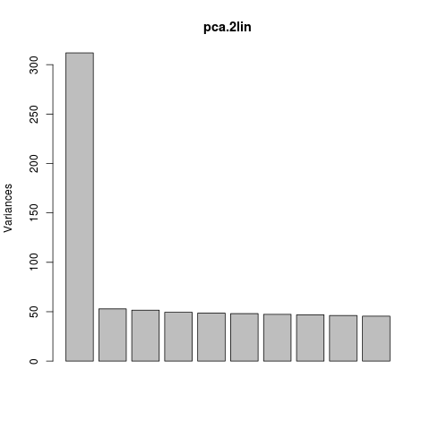
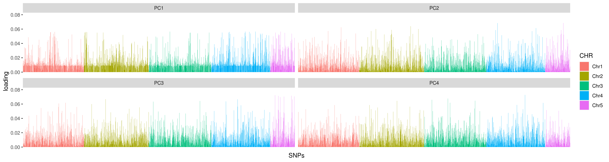

# Day2: Population structure and differentiation
## Step 1: Calculating F-statistics
### With Stacks
As you can see if you ```cd``` in one of the folders storing the output from your ```populations``` runs, STACKS produces many output files. The manual provides a thorough explanation of all the different file formats. Go to <https://catchenlab.life.illinois.edu/stacks/manual/> and scroll down to section 6.6. For each output type, open the corresponding file on the server, and take your time to explore them.

One statistics we are interested in F<sub>ST</sub>, a relative measure of differentiation between populations. Let's look at one of these files in more detail
```
cd ~/stacks/populations_2lin_random
head -n 30 populations.fst_NWA-GRE.tsv
```
F<sub>ST</sub> for each locus is at the 8<sup>th</sup> column. We can look at the 20 most differentiated SNPs with
```
grep -v "^#" populations.fst_NWA-GRE.tsv | sort -rk8,8 | head -n 20
```
```grep -v``` exclude lines that start with #, then you sort the file by values of F<sub>ST</sub> from the highest to the lowest (```-r```), and print to the screen the top 20 SNPs.

If you have more than two populations, STACKS will print out ```populations.fst_POP1-POP2.tsv``` for each unique combination of populations. Look into the ```populations_canada_random``` folder. 
```
cat populations.fst_*.tsv | grep -v "^#" - | sort -rk8,8 | head -n 20
```

Have a look at this list. Are these SNPs randomly distributed across the 5 chromosomes?


Here we can create a list of the 100 most differentiated SNPs among all populations with this one-liner
```
cat populations.fst_*.tsv | grep -v "^#" - | sort -rk8,8 | head -n 1000 | sort -un -k1,1 -k2,2 -s | sort -rk8,8 | cut -f 1,6 | tail -n +2 | head -n 100 | sort -n > high_fst.whitelist.tsv
```
which is mostly based on commands that we've just used above, with the difference that you merge all files containing population pairwise information and print only the SNP information. Note that even though the data are mapped to a reference genome, STACKS has built a catalog of loci and uses locus ID and position within the locus (stored in columns 1 and 6 in this file) to retrieve information on these SNPs (i.e. STACKS doesn't use chromosome and position to identify SNPs).

Now that we have created a 'whitelist', we can rerun populations and generate F-statistics and input files for these 100 highly differentiated SNPs only.
```
cd ~/stacks
mkdir populations_canada_random_highfst
populations -t 16 -P ~/stacks/gstacks/ -M ~/scripts/popmap_canada.txt -O populations_canada_random_highfst --fstats --vcf --genepop --structure -W ~/stacks/populations_canada_random/high_fst.whitelist.tsv
```


Whitelists and blacklists are very useful to select or discard loci for analysis. For quick data exploration, or for analysis that don't require, or can't handle, large datasets, you can use a similar code to create a whitelist with a random subset of SNPs. For 1000 SNPs for example
```
grep -v "^#" populations.sumstats.tsv | cut -f 1,4 | sort | uniq | shuf | head -n 1000 | sort -n > 1000snps_whitelist.tsv
```
Note that STACKS keep into account the whole locus, rather than just the random SNP we selected in each locus, for many statistics. Open ```populations.sumstats_summary.tsv``` for example. To help visualization you can download the file and import it in excel. Additionally, STACKS provides many haplotype-based statistics. Although we won't delve into these today, these are important to obtain estimates of D<sub>xy</sub>, a measure of absolute divergence, gene and haplotype diversity, and to phase SNPs, which can provide additional important information for both evolutionary questions and conservation applications.

See following review on the use of haplotype information in conservation genomics
```
Leitwein, M., Duranton, M., Rougemont, Q., Gagnaire, P.A. and Bernatchez, L., 2020.
Using haplotype information for conservation genomics.
Trends in Ecology & Evolution, 35(3), pp.245-258.
```

Note also that statistics will be different depending on whether you look at all SNPs in one locus or only one random SNP. See below

Statistics from ~/stacks/populations_2lin/populations.log, which includes all SNPs
```
Population summary statistics (more detail in populations.sumstats_summary.tsv):
  NWA: 39.172 samples per locus; pi: 0.054733; all/variant/polymorphic sites: 770730/45238/25848; private alleles: 18011
  GRE: 39.138 samples per locus; pi: 0.054095; all/variant/polymorphic sites: 770730/45238/27188; private alleles: 19351

Population pair divergence statistics (more in populations.fst_summary.tsv and populations.phistats_summary.tsv):
  NWA-GRE: mean Fst: 0.024875; mean Phi_st: 0.077792; mean Fst': 0.074473; mean Dxy: 0.0049455
```
Statistics from ~/stacks/populations_2lin_random/populations.log, which includes only one random SNP/locus.
```
Population summary statistics (more detail in populations.sumstats_summary.tsv):
  NWA: 39.161 samples per locus; pi: 0.051743; all/variant/polymorphic sites: 770730/8530/4634; private alleles: 3345
  GRE: 39.12 samples per locus; pi: 0.054156; all/variant/polymorphic sites: 770730/8530/5171; private alleles: 3882

Population pair divergence statistics (more in populations.fst_summary.tsv and populations.phistats_summary.tsv):
  NWA-GRE: mean Fst: 0.028809; mean Phi_st: 0.033052; mean Fst': 0.020139; mean Dxy: 0.00092926
```

Here, the value of π are not very different because they are averaged over only the polymorphic sites (which is NOT how we should estimate π anyway). Same for F<sub>ST</sub>. Do you see how different the haplotype-based estimates are? They are all lower in the random-SNP dataset because STACKS computes these statistics as if there was only one polymorphic site in each of these loci.


### With VCFtools
To calculate F<sub>ST</sub> in VCFtools you need to provide the list of samples for each population to include in the calculation. For the reduced dataset, including only 80 individuals from Greenland and Canada, you will find the list of samples for each of the two lineages in the ```~/scripts``` folder
```
vcftools --vcf populations_2lin_random/populations.snps.vcf --weir-fst-pop ~/scripts/pop_canada40.txt --weir-fst-pop ~/scripts/pop_greenland40.txt  --out fst_2lin
```
As stdout you get
```
VCFtools - 0.1.16
(C) Adam Auton and Anthony Marcketta 2009

Parameters as interpreted:
	--vcf populations_2lin_random/populations.snps.vcf
	--weir-fst-pop /home/ubuntu/scripts/pop_canada40.txt
	--weir-fst-pop /home/ubuntu/scripts/pop_greenland40.txt
	--keep /home/ubuntu/scripts/pop_canada40.txt
	--keep /home/ubuntu/scripts/pop_greenland40.txt
	--out fst_2lin

Keeping individuals in 'keep' list
After filtering, kept 80 out of 80 Individuals
Outputting Weir and Cockerham Fst estimates.
Weir and Cockerham mean Fst estimate: 0.032099
Weir and Cockerham weighted Fst estimate: 0.22947
After filtering, kept 8530 out of a possible 8530 Sites
Run Time = 0.00 seconds
```
The calculation is very fast, and in addition to per-site estimates you get mean and weighted F<sub>ST</sub> estimates, which you could save in a separate file by adding ```> fst_2lin.log``` at the end of the previous command.

If you have a reference genome and panel of SNPs dense enough (or whole genome resequencing data) you can calculate window estimates with
```
vcftools --vcf populations_2lin_random/populations.snps.filter.vcf --weir-fst-pop ~/scripts/pop_canada.txt --weir-fst-pop ~/scripts/pop_greenland.txt  --out fst_2lin_win --fst-window-size 100000 --fst-window-step 100000
```
In fact, window estimates are a practical way to summarize data and to reduce the number of datapoints to handle, which can be problematic for visualization.

We can also calculate π in VCFtools with the command
```
cd ~/stacks
vcftools --vcf populations_2lin_random/populations.snps.vcf --site-pi --keep ~/scripts/pop_canada40.txt --out pi_canada
```
However, these single-site estimates of π are not very meaningful. π is defined as the average number of nucleotide differences per site between two DNA sequences in all possible pairs in the sample population. That is the same reason why π averaged across polymorphic sites in STACKS is not meaningful either. π must be averaged across the whole length of the sequence you are analyzing, whether it is a collection of RAD loci or whole chromosomes.

#### Important! There are many different ways to estimate FST and you should always report the program and the methods used.
For example, STACKS adopts an AMOVA F<sub>ST</sub> by Weir (from Genetic Data Analysis II, chapter 5, "F Statistics," pp166-167) and VCFtools uses the F<sub>ST</sub> estimate by Weir and Cocherham (1984). These two, as you can see from the analyses above, will give you slightly different estimates. Furthermore, VCFtools provided a weighted estimate of F<sub>ST</sub> that may be better suited to capture genome-wide population differentiatiation.

## Step 2. Assessing population structure
### Structure with faststructure
STRUCTURE has been the most popular software for detecting and describing population structure since it was published 20 years ago. However, it was developed before we started genotyping thousands of markers at a time and it is therefore slow for large genomic datasets. fastSTRUCTURE (Raj eet al. 2014, Genetics) provides a much faster alternative for these datasets while it is based on a similar Bayesian framework.

We'll use the ```.structure``` file created by ```populations```. The first 6 columns of the file will be ignored; these typically would include IDs, metadata, etc. so we need to have 6 dummy columns before the genotypes for each individual/locus. Note that this software only handles bi-allelic loci. The two alleles at each locus can be encoded as desired; however, missing data should be encoded as '-9' (also check https://rajanil.github.io/fastStructure/ for details). Below is a little script to prepare the file and run fastSTRUCTURE.
```
cd  populations_all_random ### or populations_2lin_random or populations_canada_random
tail -n +3 populations.structure > populations.structure_nohead ### deletes first two rows
cut -f1-2 populations.structure_nohead > twocolumns
paste twocolumns twocolumns populations.structure_nohead | sed 's/\t0/\t-9/g' > populations.faststructure.str
conda activate faststructure ### we need to activate a conda environment with a different version of Python where faststructure is installed
structure.py -K 2 --input=populations.faststructure --output=capelin.all --format=str
```
Now you can modify the ```-K``` parameters and test different different numbers of clusters.
With this script you can test what number of populations/cluster best describes your dataset.
```
chooseK.py --input=capelin.all
```
but the results are not very clear. Indeed, it can be hard to find the the number of cluster that best describes your dataset. The qualitative analyses of structure plots for several K is often the most informative approach.

Run faststructure with K ranging 2-n, with n being the number of populations in your dataset and download the output with the ```.meanQ``` extension on your local computer. Then go to <http://pophelper.com/> and upload your ```.meanQ``` files. You can start exploring the one generated for K=2 while you run fastSTRUCTURE with the other K. pophelper is a very user-friendly, intuitive online app to visualize population structure data.

### PCA

Population structure leads to systematic patterns in measures of mean relatedness between individuals in large genomic data sets, which are often discovered and visualized using dimension reduction techniques such as principal component analysis (PCA). The results of PCA can produce "maps" of population structure that may reflect the samples' geographic origin dirstored by rates of gene flow (November et al., 2008) or other intra-genome evolutionary processes that can bond or dispel certain groups of samples. Using PCA in genomics is quite simple without the need to diving into the math.

For this analysis, we will convert vcf files into geno format (matrix of genotypes) using the programm **vcftools**.
Here, we will work with two vcf files
* vcf file containing four populations (H,L,O and U)
* vcf file containing 12 populations (A-L)

So within your own folder in the Amazon server, use this two command (cmd) lines:
```
vcftools --vcf stacks/populations_2lin_random/populations.snps.vcf --012 --out populations_2lin_random
vcftools --vcf stacks/populations_can_random/populations.snps.vcf --012 --out populations_can_random

```
Once this is done, you will see via the cmd line `ls` (for listing all files in the directory), that six new files have been generated.
* Two files ending with only `.012` contain genotypes information (0 for Ref homozygous, 1 for heterozygous, 2 for Alt homozygous and -1 for misisng data)
* Two files ending with `.012.pos` contain a list of SNP ids (Chromosme and Position) from the vcf file
* Two files ending with `.012.indv` contain a list of samples ids from the vcf file

So to work with this files, we will return in your local computer and download them.
Before downloading these files in your local computer, open a new terminal and move into your current working folder for this course ``PATH/physalia/``.
Then, you can download these files via the following command line :
```
scp -i PATH/boh.pem username@xx.xx.xx.xx:./*.012* ./02_day2/02-data/
```

Once the six files have been downloaded, open R studio and set your working directory to ``PATH/physalia/02_day2/``

#### Step 0: load the required libraries.
```
#Libraries
  library(dplyr)
  library(magrittr)
  library(tibble)
  library(ggplot2)
  library(reshape2)
```
During the PCA tutorial, I will use the awesome ``%>%``. This code feature is a pipe, which  take the output from one function and feed it to the first argument of the next function. You may have encountered the Unix pipe | before.

#### Step 1: load initial required data files
```
#1. load population map
popmap <- read.table("../00_documents/info_samples.csv", h=T,sep=';')

#2. load geno data for the 2lin
geno.012_2lin.012 <- read.table('02-data/population.2lin.rand.snp.012')[,-1] #load genotype matrix
geno.012_2lin.012.pos <- read.table('02-data/population.2lin.rand.snp.012.pos') %>% #load SNPs info
  mutate(., locus=paste(V1,V2,sep='_')) #create a new column for SNP info name (CHR + position)
geno.012_2lin.012.indv <- read.table('02-data/population.2lin.rand.snp.012.indv') #load individuals info

Set rownames and colnames to the geno matrix
dimnames(geno.012_2lin.012) <- list(geno.012_2lin.012.indv$V1, geno.012_2lin.012.pos$locus)
#check the geno matrix
geno.012_2lin[1:6,1:6]
```
```
Chr1_4669 Chr1_37123 Chr1_53559 Chr1_64218 Chr1_73377 Chr1_76193
L_01         0          0          0          0          0          1
L_02         0          0          0          0          0          0
L_03         0          0          0          0          0          0
L_04         0          0          0          0          0          0
L_05         0          0          0          0          0         -1
L_06         0          0          0          0          0          0
```
#### Step 2: Impute missing data
Missing data in 012.geno files from vcftools are coded with -1. We will change it for NAs
```
geno.012_2lin.012[geno.012_2lin.012 == -1] <- NA
```
```
Chr1_4669 Chr1_37123 Chr1_53559 Chr1_64218 Chr1_73377 Chr1_76193
L_01         0          0          0          0          0          1
L_02         0          0          0          0          0          0
L_03         0          0          0          0          0          0
L_04         0          0          0          0          0          0
L_05         0          0          0          0          0         NA
L_06         0          0          0          0          0          0
```

Here we will fill the NAs values by the most common genotype across all samples for a given SNP
```
geno.012_2lin.012.imp <- apply(geno.012_2lin.012,2,function(x){
                           replace(x, is.na(x), as.numeric(names(which.max(table(x))))) })
```
```
Chr1_4669 Chr1_37123 Chr1_53559 Chr1_64218 Chr1_73377 Chr1_76193
L_01         0          0          0          0          0          1
L_02         0          0          0          0          0          0
L_03         0          0          0          0          0          0
L_04         0          0          0          0          0          0
L_05         0          0          0          0          0          0
L_06         0          0          0          0          0          0
```

In genomics, PCA are multivariate analyses which could be bias by ultra rare variants (i.e. only represented by one sample)
>Linck, E., & Battey, C. J. (2019). Minor allele frequency thresholds strongly affect population structure inference with genomic data sets. Molecular Ecology Resources, 19(3), 639–647. doi: 10.1111/1755-0998.12995
https://onlinelibrary.wiley.com/doi/abs/10.1111/1755-0998.12995


Based on this avenue, we will filter our geno matrix by keeping only SNPs where the alternative allele is represented by at least two samples.
Usually, we name this filter as MAS for minimum number of samples with rare allele <int> eg: 2 or more.

Here I give you a custom R function to use this filter:
```
MAS <- function(geno, MAS.thresh =2){
#count number of samples which are heterozygous or rare homozygous
  get_MAS_locus <- apply(geno,2,function(x) sum(table(x)[-1]))
#get the list of locus that did not parse the threshold
  blacklist <- get_MAS_locus[get_MAS_locus < MAS.thresh]
#Print number of SNPs filtered out
  message(length(blacklist)," SNPs removed")
#return the filtered matrix
  return(geno[,-which(colnames(geno) %in% names(blacklist))])
}
```
To use it, this is simple.
```
geno.012_2lin.012.imp.MAS2 <- MAS(geno=geno.012_2lin.012.imp, MAS.thresh=2)
```
**Question : How many SNPs did not passed the MAS filter ?**

Next, we are ready to perform the PCA. The code is very simple. Only one line !
```
pca.2lin <- prcomp(geno.012_2lin.imp.MAS2, scale=T)
```
Now, we will look at some interesting stats from the PCA object. First we will plot the variances against the number of the principal component.
```
screeplot(pca.2lin)
```


From the screeplot we can see that the amount of variation explained drops dramatically after the first component. This suggests that just one component may be sufficient to summarise the data.
Next, we will check for the proportion of variance explained by each PC axis.
```
#get stats info from the pca
sum.pca <- summary(pca.2lin)
#print stats info
sum.pca$importance[,1:5]
```
```
                          PC1      PC2      PC3      PC4      PC5
Standard deviation     17.66092 7.271187 7.180096 7.033057 6.972352
Proportion of Variance  0.09911 0.016800 0.016380 0.015720 0.015450
Cumulative Proportion   0.09911 0.115910 0.132290 0.148010 0.163460
```
Here you can see that the first PC axis (PC1), explain 9.91% of the total variance. Others PC axes explain about 1.5% of the variance.

OK ! now we are ready to make a plot of our PCA. To do this, there is so many ways and R libraries.
I will present you my own with the R library ggplot2, which is a highly modulable way.

First, we have to make a synthetic dataframe which incorporate various features:
* Number of PCs that we want to examine. Usually I keep the first four PCs, but you can keep more.
* Sample ids
* Popupations info
* any other caracteristics that you want, which are related to the samples (e.g. size, color, sex...)

So how we do that ?
```
#prepare dataset to plot PCAs
pca.2lin.sub <- pca.2lin$x[,1:4] %>% #retain the first four PCs
  as.data.frame(.) %>% #transform to dataframe object
  tibble::rownames_to_column(., var='id') %>% #set rownames to a new column for samples ids
  dplyr::left_join(., popmap, by='id') #Here we use the left_join function
                                       #from dplyr to wrap the population vector
                                       #of our samples.
```
Almost done! Now we will use the ggplot library to make a super figure !
```
ggplot(pca.2lin.sub) + aes(x=PC1, y=PC2, col=pop) +
  geom_hline(yintercept = 0, lty=2, col='grey50') + #add horiz line at y=0
  geom_vline(xintercept = 0, lty=2,col='grey50') +  #add vertical line at x=0
  geom_point() + #add the samples
  scale_color_manual(values=c('orange','purple','royalblue', 'cyan')) + #define a new color scale
  theme_bw() + #use  classic dark-on-light ggplot2 theme
  theme(panel.background = element_rect(fill='white'), #set some theme options
        panel.grid = element_blank())

#Print it !
ggsave("03-analyses/02-PCA/PCA_biplpot_2lin_capelin.png", width = 6, height = 5)
```
Done ! Good job.


Now, the question is what do you see ?

Ultimately, we will plot the PCA loadings of each SNPs among the main PC axies.
```
# |---------|
# | Step 4  | ================> Expolore PCA loadings
# |---------|

#prepare dataset
loadings.melt <- reshape2::melt(abs(pca.2lin$rotation[,1:4])) %>% #get absolu teloadings values
  set_colnames(., c('SNPs','PC','loading')) %>% #set the colnames of the new dataframe
  mutate(., CHR=substr(SNPs,1,4)) #create a new column to inform about chromosome

#plot the data
ggplot(data=loadings.melt) +
  geom_bar(aes(x=SNPs, y=loading, fill=CHR), stat='identity') +
  facet_wrap(~PC) +
  theme(axis.text.x = element_blank(),
        axis.ticks.x = element_blank())

#Print it !
ggsave("PCA_loadings.png", height = 4, width = 15)
```


Here we can observe that many SNPs account for an elevated loading which explain the structure of the PCA display above. Interestingly, we can observe that these SNPs with large loadings are spread over all the genome.

* **Note:** Don't forget to save your script in your own local folder ``02_day2/00-scripts/``

Ok, that was easy no ? Well, I'm sure that you are able to do the same work for the other dataset composed by the 12 populations.
Test it and tell us what are your conclusions about it ?

I think you should be able to do this in <20 minutes.


### DAPC
A Discriminant Analysis of Principal Components is a multivariate approach that merges a Principal Component Analysis (PCA) and a Discriminant Analysis (DA). A PCA aims to summarize the variation among individuals and it runs very fast, also on large datasets. However, it is not powerful at discriminating groups because it doesn't use any a priori information on grouping, and intra-group variation can overwhelm inter-group variation. A DA, on the other hand, tries to summarize the variation among groups, while minimizing the variatoin within groups. Thus, a DAPC takes the best of the two analyses to describe population structure. Also, compared to structure-like analysis it is not based on strict model assumptions and is more powerful at describing isolation-by-distance and hierarchical structure that the Bayesian approaches implemented in STRUCTRURE, fastSTRUCTURE, or ADMIXTURE.

On your desktop, create three new folders named ```populations_2lin_random```, ```populations_all_random``` and  ```populations_canada_random``` and download the file ```populations.snps.structure``` from each of three corresponding ```populations``` folders on the server. Change extension ```.structure```to ```.str``` of each of three files and open R Studio. Let's start analyzing the reduced dataset including 80 individuals from Canada and Greenland.
```
### load adegenet package
library(adegenet)
### set working directory
setwd("~/Desktop")
### load dataset and convert it from structure to genind format
twolin<-import2genind("populations_2lin_random/populations.str") # 80 ind and 8530 SNPs in my case, check your populations.log file to get the right number of SNPs
### This command will prompt questions about the structure of the file
```

```
### Once the dataset is loaded, you can proceed with the DAPC
dapc_twolin<-dapc(twolin) ### choose 50 PCs and 1 distriminant function, as you did have a choice...
###To plot results
scatter(dapc_twolin)
```
Because our dataset contains only two groups, NWA (Canada) and GRE (Greenland), we have only one discriminant function available. For this reason, we can plot our results across only one axis of variation. However, you can see that that's enough to sharply and unequivocally separate the Canadian and Greenlandic lineages.

You can repeat this analysis with the full dataset ```populations_all_random/populations.str```.
```
all<-import2genind("populations_all_random/populations.str") # 280 ind and 7943 SNPs
dapc_all<-dapc(all) ### play with number of PC and DF
scatter(dapc_all)
```
What do you see now?

If any structure is present among the Canadian populations, it may be hidden by the strong differentiation between the Canadian and Greenlandic lineages.
So let's repeat the analysis including only the Canadian populations, and use this to explore how to select the right number of PCs. Run and visualize the DAPCs based on 100 and 200 PCs.
```
canada<-import2genind("populations_canada_random/populations.str") # 240 ind and 8080 SNPs
dapc_canada1<-dapc(canada, n.da=4, n.pca=100)
dapc_canada2<-dapc(canada, n.da=4, n.pca=200)
scatter(dapc_canada1)
```

```
scatter(dapc_canada2)
```


If too few PCs (with respect to the number of individuals) are retained, useful information will be excluded from the
analysis, and the resultant model will not be informative enough to accurately discriminate
between groups. By contrast, if too many PCs are retained, this will have a destabilising
effect on the coefficients extimated, leading to problems of overfit. In such cases, the
model is able to describe all of the data in such detail that it becomes flexible enough
to discriminate almost perfectly between any possible clusters.

However, we can assess the trade-off between power of discrimination and over-fitting by calculating the alpha-score, which is the difference between the proportion of successful reassignment of the analysis (observed discrimination) and values obtained using random groups (random
discrimination).
```
temp1 <- optim.a.score(dapc_canada1)
temp2 <- optim.a.score(dapc_canada2)
```
These analyses suggest I should use fewer PCs, around 50.
```
dapc_canada1<-dapc(canada, n.da=4, n.pca=50)
```


Another way to see the effect of the choice of the number of PCs is from stucture-like plots made with the function ```compoplot```, which plots the assignemnt proportions of each individual.
```
compoplot(dapc_canada1)
```

```
compoplot(dapc_canada2)
```

```
compoplot(dapc_canada3)
```


Although 200 PCs discriminate populations well, we know from low pairwise population F<sub>ST</sub> that differentiation is very low, which lead us to conclude that these high population assignments are the consequence of data over-fitting. On the other hand, the poor population assignemnt you obtain from 50 PCs is indicative of the weak population structure among the Canadian populations.

You can change pretty much everything in your plot and the authors of adegenet have put together a great tutorial <https://adegenet.r-forge.r-project.org/files/tutorial-dapc.pdf>

## Step 3. Assessing population structure heterogeneity across the genome
### Sliding PCA (Claire)
As you saw earlier, the PCA performed on the 240 samples from North America display a very unexpected pattern. The loadings indicate that some portion of the genome are overwhelmingly driving the structure.We suspect there may be sex-linked markers and/or chromosomal rearrangements
To get a better sense of what's going on, we will be doing PCA again, but along the genome by window of X SNPs.For this we will use  R package * lostruct* available here https://github.com/petrelharp/local_pca and presented in this publication https://www.genetics.org/content/211/1/289

This analysis is more powerful if we keep all SNPs including those in LD so we will come back to the vcf unfiltered

#### step 0: prepare the vcf
Please make a folder called 05_localPCA in your 02_day2 folder, and copy there the unfiltered vcf for the 12 NWA populations.
We will use several programms to convert this vcf into a bcf, sort it and index it.
The package lostruct can also take a vcf but it is heavy to laoad the whole file. Instead they made function that is able to cut the vcf window by window to avoid overloading the memory (but this requires a sorted, indexed bcf)
```
mkdir 05_localPCA
cp "the path where it is..."/capelin_NWA.vcf 05_localPCA/

cd 05_localPCA
#we need to sort the vcf
(grep ^"#" capelin_NWA.vcf; grep -v ^"#" capelin_NWA.vcf | sort -k1,1 -k2,2n) > capelin_NWA_sorted.vcf

#then compress it and index it
bgzip -c capelin_NWA_sorted.vcf > capelin_NWA_sorted.vcf.gz
tabix -fp vcf capelin_NWA_sorted.vcf.gz

#then convert it to a bcf and sort it
bcftools convert -O b capelin_NWA_sorted.vcf.gz > capelin_NWA_sorted.bcf
bcftools index capelin_NWA_sorted.bcf
```

Now we are good to work in R with the library. This requires some computational power and memory, so we suggest to make the initial steps in R command lines on the server and then copy the output files to visualise on your local Rstudio

#### Step 1: run lostruct
To start R in command line, just type "R". Now you have a R console and we wil run the lostruct procedure

```
#open library
library(lostruct)
options(datatable.fread.input.cmd.message=FALSE)  #disable a useless message
snps <- vcf_windower("capelin_NWA_sorted.bcf",size=100,type='snp', sites= vcf_positions("capelin_NWA_sorted.bcf"))
```
This function makes windows out of the given data file of your chosen size. You can choose the size of the window with "size" and on which variable you want to split ('snp' or 'bp'). We suggest to use window of 100 snp since we are not very dense (RAD data) and we don't have a lot of snps.Typically with whole genome you may first run by windows of 1000 or 5000 snps for a first look, and then refine with smaller windows. The analysis can be run chromosome by chromosome (as in the paper) or on the entire genome. Here, we are going for the entire genome.

You can display for instance the 5th window and know its location by doing
```
snps(5)
region(snps) (5)
```
We can now run the PCA on all windows. Here we choose to consider k=npc=2 because they usually capture most variance for each local PCA
```
pcs <- eigen_windows(snps,k=2)
dim(pcs) #check dimension
head (pcs[,1:10]) #look at the first 10 columns
pcs_noNA<-pcs[-which(is.na(pcs[,1])),] #because of NA, some windows were not computed by pca. we will remove them
```
In the matrix pcs, each rows give the first k eigenvalues and k eigenvectors for each window. This gives you a matrix with 483 columns (3 columns of info, 240 columns with PC1 score for each individual, and 240 column with PC2 score for each individual). It has as many rows as windows (1016 with windows of 100 SNPs)

As you see we don't know the position of each window, we will get it with the function regions, remove the NA windows and exapnd the pca matrix to include the position information we retrieve before and export the file
```
#retrieve positions
window_pos<-region(snps)()
head(window_pos)

#keep windows without NA
window_pos_noNA<- window_pos[-which(is.na(pcs[,1])),]
#merge
pca_matrix_noNA<-cbind(window_pos_noNA, pcs_noNA)
head (pca_matrix_noNA[,1:10])

#save the file
write.table(pca_matrix_noNA, "pca_matrix.txt", sep="\t", row.names=FALSE, quote=FALSE)
```
Now the lostruct procedure proposes to compute pairwise distances between those windows and visualise it with a MDS (multidimensional scaling). Our goal is to identify groups of windows which display similar PCA pattern.This is done with the following functions (we uses 2 PC per window as above, and will look at the 1st 10 axes of the MDS)
```
pcdist <- pc_dist(pcs_noNA,npc=2)
mds_axe<-cmdscale(pcdist, k=10)
head(mds_axe)

#again the mds file is missing position information so:
mds_matrix<-cbind(window_pos_noNA, mds_axe)
write.table(mds_matrix, "mds_matrix.txt", sep="\t", row.names=FALSE, quote=FALSE)
```
Since this is a little long , we will let it run and explore on your local computer with Rstudio some of the local pca. Let's download pca_matrix.txt locally and we will play in R studio to look at some of those local PCA

#### Step 2 Visualising the local PCA outputs
Back on our local computer in R studio, we will look at all those local PCA.
First let's go in R, set the working directory, load useful libraries (ggplot2) and the matrix of pca

```
pca_matrix<-read.table("pca_matrix.txt", header=TRUE)
pca_matrix[1:10,1:10]
n_windows<-dim(pca_matrix)[1] # the number of windows we have
```

We may want to simply plot the pca for some windows. This is not the most easy because remember the format is a bit tricky
Look at the format. We have 3 columns for position, total eigen values, eigvalue of PC1, of PC2 and then 240 values for PC1 scores of all our samples, and 240 values for PC2 scores of all samples
```
   chrom   start     end      total    lam_1     lam_2   PC_1_L_01    PC_1_L_02    PC_1_L_03    PC_1_L_04
1   Chr1    4598  102627 11.2676700 2.237855 1.2467539  0.04757381  0.003211281  0.048236420 -0.029799279
2   Chr1  102627  298945  5.4675252 1.664517 1.1009505  0.05177397 -0.066433281  0.056306263  0.057187867
3   Chr1  298949  557448 20.3195707 3.514855 2.5803417 -0.07997331 -0.014285140 -0.077618567  0.061921540
4   Chr1  557463  664701  7.9826780 1.707709 1.4688195  0.00317093 -0.027442327 -0.003586276 -0.025939893
```

So to get information for a window we can fo something like:
```
Nind<-240

pc1_i<-t(pca_matrix[i, 7:(Nind+6)]) #scores along PC1
pc2_i<-t(pca_matrix[i, (Nind+7):(2*Nind+6)]) #scores along PC2
var1<-round(pca_matrix[i, 5]/pca_matrix[i, 4],2)*100 # % of variance explained by PC1
var2<-round(pca_matrix[i, 6]/pca_matrix[i, 4],2)*100 # % of variance explained by PC2
midpos_i<-(pca_matrix[i, 2]+pca_matrix[i, 3])/2 #average position of the window
window_i<-paste(pca_matrix[i, 1], midpos_i , sep="_") #paste the name of CHR and the midposition

plot(pc1_i, pc2_i, pch=20, xlab=paste("PC1", var1 , "%"), ylab=paste("PC2", var2, "%"), main=window_i)
```

Not super clean but it works. Building on  that you can do anything to reformat your matrix of PC, eigen values, etc...

Now what do we want to know, we want to look which windows explain the pattern observed in the global pca. We can look at correlation between global PCs and PC1 of each local PCA. I propose to take the PCA you did earlier on the 12 NWA populations, and look at the correlation between PC1 of the global PCA and PC1 of each local PCA. (then you can do the same with PC2 of the global PCA and PC1 of each local PCA...
I suggest below a very basic loop to store the correlation by windows. You can probably do something more fancy :-)
Please note here that we could also have used the genotype correlation, for instance call 0/1 or 0/1/2 the cluster observed on the global pca and then look for each snps at the correlation between genotypes and gneotype for the cluster identified.

```
#read your global pca file that you did earlier today on the 12 NWA populations (and saved?)
global_pca<-read.table("where you saved the global pca")
PC_of_interest<-global_pca[,1] #if you want to look at correlation with PC1

#initialise the vector
corr_vector<- vector(length=n_windows)
#loop over windows to store correlation factor
for (i in 1 : n_windows)
{
  pc1_i<-t(pca_matrix[i, 7:(Nind+6)]) #scores along PC1
  corr_vector[i]<-abs(cor(PC_of_interest, pc1_i)[1,1])
}

```
Now let's merge correlation and position to do a Manhattan plot of correlation along the genome. We need to take a midposition for each window.
I suggest that we use ggplot to visualize and facet_grid is a useful way to make quick Manhattan plot with chromosome side by side
```
pca_correlation<-cbind(pca_matrix[,1:3], corr_vector)
pca_correlation$midpos<-(pca_correlation$start+pca_correlation$end)/2
head(pca_correlation)

ggplot(pca_correlation, aes(x=midpos, y=corr_vector, colour=chrom))+
  geom_point()+
  theme_classic()+
  facet_grid(cols = vars(chrom), scales = "free_x", space="free_x")
```

What do you see?  Which windows correlate with PC1? What do you think?


Now you can have a look at correlation between local PC1s and the global PC2...

#### Step 3 Using the MDS
Here that was easy, because we knew there was something weird on PC1 and PC2. But please keep in mind that, even if on the global PCA, no region is driving a specific clustering, there may still be, on some chromosome, or some regions, similar clustering of individuals that reveal population structure, chromosomal rearragements, sex, non recombining haploblocks, etc. Exploring the MDS is a way to detect such heterogeneity in the genome.

Let's load the mds and plot the first axes
```
mds_matrix<-read.table("mds_matrix.txt", header=TRUE)
head(mds_matrix)
mds_matrix$midpos<-(mds_matrix$start+mds_matrix$end)/2

#for ggplot you need to rename the columns
colnames(mds_matrix)<-c("chrom","start","end","mds1","mds2","mds3","mds4","mds5","mds6","mds7","mds8","mds9","mds10")

ggplot(mds_matrix, aes(x=mds1, y=mds2, colour=chrom))+
  geom_point()+
  theme_classic()
ggplot(mds_matrix, aes(x=mds3, y=mds4, colour=chrom))+
  geom_point()+
  theme_classic()
```


As you see, MDS 1 and 2 are largely driven by Chr 4 and Chr5. Let's look at mds scores along the genome to pinpoint those regions
Building on what we did before, you can probably make a Manhattan plot with a midposition as x, and mds1 or mds2 as y.

This is the output for MDS2


To follow-up, You can try to find approximately the breakpoints of those areas that appear outliers
We will come back to those regions later (on day 4) to analyse them. In the meantime to look at the geographic structure of the populations, we suggest that you remove them from your analyses.

#### A note about running R into a terminal or on a server
Instead of running R frontally, as we did at the beginning for lostruct, we could have written a whole script and run it with
```
Rscript my_fancy_script.R "option1" "option2"
```
The first lines my_fancy_script.R would be:
```
argv <- commandArgs(T)
option1 <- argv[1]
option2 <- argv[2]
```

### Repeat analyses for geographic structure on different genomic regions/chromosomes
#### Making a vcf without Chr 4 and Chr5

We can use the filtering options of vcftools to exclude the chromosomes 4 and 5:

```
vcftools --vcf population.can.random.snp.vcf --not-chr Chr4 --not-chr Chr5 --recode --out population.can.random.snp.without45
```

If you want to play or if you finish early, you can look at how excluding just a region of Chr4...

#### RE-run the geographic structure analysis for Canadian population on the reduced vcf
Time to apply what you learnt earlier today!
