# Day 2: Population structure and differentiation
## 1: Calculating F-statistics
First we will copy the folder of day2 and work within it. 

We have put inside that folder the similar files that you produced yesterday with Stacks, except that they are compressed to fit on github. 

So if you have not managed to finish the tutorial, if you forgot where the files were generated yesterday (and even if you don't have access to the server and work on your own computer), don't worry they are here.

```
cd #make sure you are at the root of the directory 
cp -r ~/Share/physalia_adaptation_course/02_day2 .
cd 02_day2
```


There are many ways, approaches, software and formulas to calculate F<sub>ST</sub>, a relative measure of population differentiation. Here we will use mainly VCFtools. If you want to explore Stacks for summary statistics in your spare time you will find a Stacks specific tutorial [here](./summary_stats_stacks.md)

In VCFtools you need to provide the list of samples for each population to include in the calculation and a VCF file with all your variants and associated information. For the reduced dataset, including only 80 individuals from Greenland and Canada, you will find the list of samples for each of the two lineages in the ```~/scripts``` folder. The VCF file name is saved as ```populations.snps.vcf```, one for each of the datsets we analyzed. For example, to calculate F<sub>ST</sub> in the smallest of the three datsets we produced, type
```
gunzip populations_2lin_random/populations.snps.vcf.gz
vcftools --vcf populations_2lin_random/populations.snps.vcf --weir-fst-pop documents/pop_canada40.txt --weir-fst-pop documents/pop_greenland40.txt  --out FST/fst_2lin
```

Note that we directed all the vcf output inside the FST folder.
In the terminal, you get

```
VCFtools - 0.1.16
(C) Adam Auton and Anthony Marcketta 2009

Parameters as interpreted:
	--vcf populations_2lin_random/populations.snps.vcf
	--weir-fst-pop /home/ubuntu/scripts/pop_canada40.txt
	--weir-fst-pop /home/ubuntu/scripts/pop_greenland40.txt
	--keep /home/ubuntu/scripts/pop_canada40.txt
	--keep /home/ubuntu/scripts/pop_greenland40.txt
	--out fst_2lin

Keeping individuals in 'keep' list
After filtering, kept 80 out of 80 Individuals
Outputting Weir and Cockerham Fst estimates.
Weir and Cockerham mean Fst estimate: 0.032099
Weir and Cockerham weighted Fst estimate: 0.22947
After filtering, kept 8530 out of a possible 8530 Sites
Run Time = 0.00 seconds
```
The calculation is very fast, and in addition to per-site estimates you get mean and weighted F<sub>ST</sub> estimates, which you could save in a separate file by adding ```> fst_2lin.log``` at the end of the previous command.

If you have a reference genome and panel of SNPs dense enough (or whole genome resequencing data) you can calculate window estimates with
```
vcftools --vcf populations_2lin_random/populations.snps.vcf --weir-fst-pop documents/pop_canada40.txt --weir-fst-pop documents/pop_greenland40.txt  --out FST/fst_2lin_win --fst-window-size 100000 --fst-window-step 100000
```
In fact, window estimates are a practical way to summarize data and to reduce the number of datapoints to handle, which can be problematic for visualization.


Now, to visualise it, we recommend that you can download the file from the server to your own computer with Filezilla. The best is to download the whole folder 02-day2, so that you will always work with the same folder/file names and hierarchy as the rest of the group.

On your local computer, in R studio, simply set your working directory to 02-day2

To do Manhattan plot, there are great packages like QQMan
https://cran.r-project.org/web/packages/qqman/vignettes/qqman.html

And you can also simply use ggplot if you have few Chromosomes
```
library(ggplot2)

Fst<-read.table("FST/fst_2lin_win.windowed.weir.fst", header=T)
Fst$midPos<-(Fst$BIN_START+Fst$BIN_END)/2
head(Fst)

ggplot(Fst, aes(x=midPos/1000000, y=WEIGHTED_FST, col=CHROM))+
	geom_point()+ geom_smooth()+ theme_classic()+
	facet_grid(cols = vars(CHROM), scales = "free_x", space="free_x")+
	labs(  x = "position (in MB)")

```

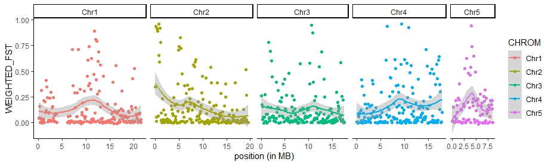


Back on the server:

We can also calculate π in VCFtools with the command
```
vcftools --vcf populations_2lin_random/populations.snps.vcf --site-pi --keep documents/pop_canada40.txt --out FST/pi_canada
```
However, these single-site estimates of π are not very meaningful. π is defined as the average number of nucleotide differences per site between two DNA sequences in all possible pairs in the sample population. That is the same reason why π averaged across polymorphic sites in STACKS is not meaningful either. π must be averaged across the whole length of the sequence you are analyzing, whether it is a collection of RAD loci or whole chromosomes.

#### Important! Because there are so many different ways to estimate F<sub>ST</sub> and you should always report the program and the methods used.
For example, STACKS adopts an AMOVA F<sub>ST</sub> by Weir (from Genetic Data Analysis II, chapter 5, "F Statistics," pp166-167) and VCFtools uses the F<sub>ST</sub> estimate by Weir and Cocherham (1984). These two will give you slightly different estimates. Furthermore, VCFtools provided a weighted estimate of F<sub>ST</sub> that may be better suited to capture genome-wide population differentiatiation.

####  optional: Investigate structure in relation to geography

To assess genetic structure in relation to geography and pre-existing partitions (e.g. sampling locations), we can also look into population pairwise F<sub>ST</sub>. Here is an extra tutorial to get a matrix of population pairwise F<sub>ST</sub> (for the 12 Canadian populations) and assess whether genetic differentiation iscorrelated with geographic distance (e.g., isolation-by-distance). If you have extra time, or need it in the future, you can find the tutorial at this link below

[Population pairwise F<sub>ST</sub> and IBD tutorial - extra](IBD.md)


## 2. PCA

Population structure leads to systematic patterns in measures of mean relatedness between individuals in large genomic data sets, which are often discovered and visualized using dimension reduction techniques such as principal component analysis (PCA). The results of PCA can produce "maps" of population structure that may reflect the samples' geographic origin dirstored by rates of gene flow (November et al., 2008) or other intra-genome evolutionary processes that can bond or dispel certain groups of samples. Using PCA in genomics is quite simple without the need to diving into the math.

For this analysis, we will convert vcf files into geno format (matrix of genotypes : 0,1,2) using the programm **vcftools** on the server.

Here, we will work with two vcf files
* vcf file containing four populations with the two lineages (H,L,O and U)
* vcf file containing 12 populations from Canada (A-L)

In genomics, PCA are multivariate analyses which could be bias by ultra rare variants (i.e. only represented by one sample)
>Linck, E., & Battey, C. J. (2019). Minor allele frequency thresholds strongly affect population structure inference with genomic data sets. Molecular Ecology Resources, 19(3), 639–647. doi: 10.1111/1755-0998.12995
https://onlinelibrary.wiley.com/doi/abs/10.1111/1755-0998.12995

So we will also restrict our matrix to the most frequent SNPs (MAF> 1%). We can do this thanks to vcf tools.

```
vcftools --vcf populations_2lin_random/populations.snps.vcf --maf 0.01 --012 --out pca/populations_2lin_random

#if the second file is not unzipped use:
gunzip populations_canada_random/populations.snps.vcf
vcftools --vcf populations_canada_random/populations.snps.vcf --maf 0.01 --012 --out pca/populations_can_random
```
Once this is done, you will see via the cmd line `ls pca` (for listing all files in the directory), that six new files have been generated.
* Two files ending with only `.012` contain genotypes information (0 for Ref homozygous, 1 for heterozygous, 2 for Alt homozygous and -1 for misisng data)
* Two files ending with `.012.pos` contain a list of SNP ids (Chromosme and Position) from the vcf file
* Two files ending with `.012.indv` contain a list of samples ids from the vcf file

In this folder we also have all information about individuals. So to play with the pca, we will return in your local computer and simply download the whole pca folder.

Now please download the six files on your local computer inside the folder pca (inside 02-day2).

We will now work on R studio setting (or keeping) your working directory to this folder ``02_day2``

#### Step 0: load the required libraries.
```
#Libraries
  library(dplyr)
  library(magrittr)
  library(tibble)
  library(ggplot2)
  library(reshape2)
```
During the PCA tutorial, I will use the awesome ``%>%``. This code feature is a pipe, which  take the output from one function and feed it to the first argument of the next function. You may have encountered the Unix pipe | before.

#### Step 1: load initial required data files
```
#1. load population map
popmap <- read.table("pca/info_samples.csv", h=T,sep=';')
#if this doesn't work, please import amnually or  try 
popmap <- read.csv("pca/info_samples.csv", sep=';')

#2. load geno data for the 2lin
geno.012_2lin <- read.table("pca/populations_2lin_random.012")[,-1] #load genotype matrix
geno.012_2lin.pos <- read.table("pca/populations_2lin_random.012.pos") %>% #load SNPs info
  mutate(., locus=paste(V1,V2,sep='_')) #create a new column for SNP info name (CHR + position)
geno.012_2lin.indv <- read.table("pca/populations_2lin_random.012.indv") #load individuals info

#Set rownames and colnames to the geno matrix
dimnames(geno.012_2lin) <- list(geno.012_2lin.indv$V1, geno.012_2lin.pos$locus)
#check the geno matrix
geno.012_2lin[1:12,1:9]
```
```
     Chr1_37052 Chr1_53559 Chr1_76199 Chr1_102662 Chr1_116280 Chr1_144508 Chr1_223680 Chr1_225678 Chr1_264059
L_01          0          0          0           0           0           0           0           0           0
L_02          0          0          0           0           0           0           0           1           0
L_03          0          0          0           0           0           1           0           0           0
L_04          0          0          0           0           0           0           0           0           0
L_05          0          0          0           0           0           0           0           0           0
L_06          0          0          0           0           0           0           0           1           0
L_07          0          0          0           0           0           0           0           0           0
L_08          0          1          0           0           1           1           0           0           0
L_09          0          0          0           0           0           0           0           0           0
L_10          0          0          0           0           0           0           0           1           0
L_11          0          1          0           0           0           0           0           1          -1
L_12          0          0          0           0           0           0           0           0          -1
```
#### Step 2: Impute missing data
Missing data in 012.geno files from vcftools are coded with -1. We will change it for NAs. And we will fill the NAs values by the most common genotype across all samples for a given SNP
```
geno.012_2lin[geno.012_2lin == -1] <- NA

geno.012_2lin.imp <- apply(geno.012_2lin,2,function(x){
                           replace(x, is.na(x), as.numeric(names(which.max(table(x))))) })
```
#### Step 3: Run and visualise PCA
Next, we are ready to perform the PCA. The code is very simple. Only one line !
```
pca.2lin <- prcomp(geno.012_2lin.imp)
```
Now, we will look at some interesting stats from the PCA object. First we will plot the variances against the number of the principal component.
```
screeplot(pca.2lin)
```
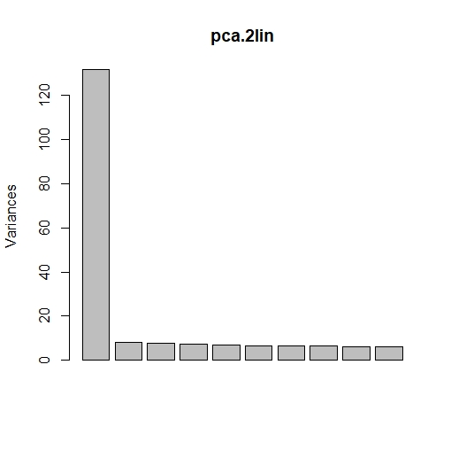

From the screeplot we can see that the amount of variation explained drops dramatically after the first component. This suggests that just one component may be sufficient to summarise the data.
Next, we will check for the proportion of variance explained by each PC axis.
```
#get stats info from the pca
sum.pca <- summary(pca.2lin)
#print stats info
sum.pca$importance[,1:5]
```
```
                            PC1      PC2      PC3      PC4      PC5
Standard deviation     11.47642 2.867703 2.788018 2.730173 2.602429
Proportion of Variance  0.26852 0.016770 0.015850 0.015200 0.013810
Cumulative Proportion   0.26852 0.285290 0.301140 0.316330 0.330140
```
Here you can see that the first PC axis (PC1), explain 27% of the total variance. Others PC axes explain about 1.5% of the variance.

OK ! now we are ready to make a plot of our PCA. To do this, there is so many ways and R libraries.
I will present you my own with the R library ggplot2, which is a highly modulable way.

First, we have to make a synthetic dataframe which incorporate various features:
* Number of PCs that we want to examine. Usually I keep the first four PCs, but you can keep more.
* Sample ids
* Populations info
* any other caracteristics that you want, which are related to the samples (e.g. size, color, sex...)

And then plot with ggplot
```
#prepare dataset to plot PCAs
pca.2lin.sub <- pca.2lin$x[,1:4] %>% #retain the first four PCs
  as.data.frame(.) %>% #transform to dataframe object
  tibble::rownames_to_column(., var='id') %>% #set rownames to a new column for samples ids
  dplyr::left_join(., popmap, by='id') #Here we use the left_join function
                                       #from dplyr to wrap the population vector
                                       #of our samples.
#plot
ggplot(pca.2lin.sub) + aes(x=PC1, y=PC2, col=pop) +
  geom_hline(yintercept = 0, lty=2, col='grey50') + #add horiz line at y=0
  geom_vline(xintercept = 0, lty=2,col='grey50') +  #add vertical line at x=0
  geom_point() + #add the samples
  scale_color_manual(values=c('orange','purple','royalblue', 'cyan')) + #define a new color scale
  theme_bw() + #use  classic dark-on-light ggplot2 theme
  theme(panel.background = element_rect(fill='white'), #set some theme options
        panel.grid = element_blank())

#Print it !
ggsave("pca/PCA_biplot_2lin.png", width = 6, height = 5)
```
Done ! Good job.


Now, the question is what do you see ?

#### Step 4: Explore PCa loadings
Ultimately, we will plot the PCA loadings of each SNPs among the main PC axies.
```
#prepare dataset
loadings.melt <- reshape2::melt(abs(pca.2lin$rotation[,1:4])) %>% #get absolu teloadings values
  set_colnames(., c('SNPs','PC','loading')) %>% #set the colnames of the new dataframe
  mutate(., CHR=substr(SNPs,1,4)) #create a new column to inform about chromosome

#plot the data
ggplot(data=loadings.melt) +
  geom_bar(aes(x=SNPs, y=loading, fill=CHR), stat='identity') +
  facet_wrap(~PC) +
  theme(axis.text.x = element_blank(),
        axis.ticks.x = element_blank())

#Print it !
ggsave("pca/PCA_loadings.png", height = 4, width = 15)
```
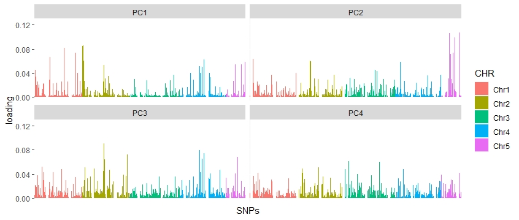

Here we can observe that many SNPs account for an elevated loading which explain the structure of the PCA display above. Interestingly, we can observe that these SNPs with large loadings are spread over all the genome.

#### PCA on the Canadian dataset only
Now let's do the same work for the other dataset composed by the 12 populations.
Test it and tell us what are your conclusions about it. You can run exactly the same script, simply changing the input files. When running ggplot you will need more colour values for populations. you cna also try to colour by sex.

Here is a script for the canadian populations, if you are stuck.
[PCA_12canada](pca/script_pca_12canada.r)

And here is what you will observe: 

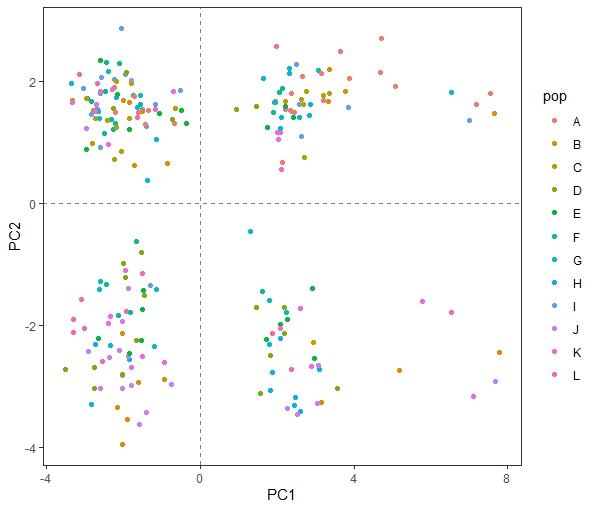
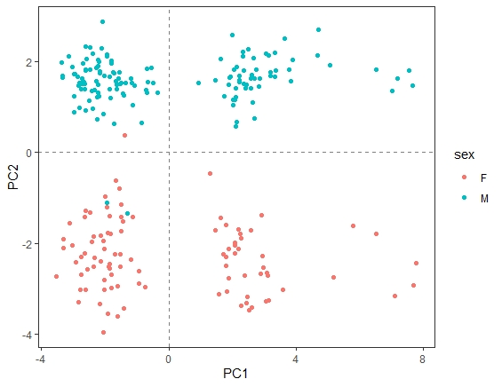


Long story short, what drives PC1 is likely a chromosomal rearrangement that we will better explore on day 4. PC2 is driven by sex. In weakly-structured species, this kind of rearrangements or sex-linked loci can realy drive the pattern, for the PCA, the Admixture/Structure analysis and Fst, so it is sometimes a good idea to exlude those regions or work on a subset of LD-pruned SNPs.

# Tutorial 2
## 3. Structure with LEA
Here, we will investigate population structure using LEA. Briefely, LEA is an R package developped by Eric Frichot and Olivier Fraņcois (Grenoble University, France), which is dedicated to landscape genomics and ecological association tests. This package includes many tools such as missing data imputation, genome scan for selection, testing for association between genotypes and environment and analyses of population structure. Here, we only test the population structure approach, which is very easy to implement.
If you want to learn more about LEA, you feel free to visit the R vignette at "https://www.bioconductor.org/packages/devel/bioc/vignettes/LEA/inst/doc/LEA.pdf"


Here, we will screen for population structure among populations two datasets, the population_2lin_random and the population_canada_random.

Today, I will show you only the guidelines for the population_2lin_random.vcf dataset. Next, I let you to practice for the second one. 

Because LEA is a R package, you need to work in R environment. We recommand that you do it on your own computer but you can always start a R session on the server with the command 'R'.

### Step 1: Prepare input files
To conduct population structure analyses, LEA needs its own input format (LEA geno-like format). Great 👍, the authors of the R package give us a useful function to do it easely !

```
#load the library
library(LEA)
#change vcf to geno 
#note that we are working in the directory 02-day2 telling the program the path of the populations.snps.vcf is inside the folder populations_2lin_random, and the output should go inside the folder LEA, with the name population_2lin_random.geno.

LEA::vcf2geno("populations_2lin_random/populations.snps.vcf",
              output.file = "LEA/population_2lin_random.geno")
              
```
### Step 2: modeling Ancestry proportions
Now that we have our input file ready, we will perform the inference of individual admixture coefficients using the snmf function.
In short, this function provides results very similar to programs such as STRUCTURE or Admixture. Assuming K ancestral populations, the function snmf provides least-squares estimates of ancestry proportions rather than maximum likelihood estimates (Frichot 2014). 
The results will allow us to determine what is the best K value, i.e. the most likely number of genetic clusters.
```
#testing K populations: from K=1 to K=10
obj <- snmf("LEA/population_2lin_random.geno", K = 1:10, ploidy = 2,
            entropy = T, CPU =4, project = "new")
```
The snmf function computes an entropy criterion, which assesses the fit of the statistical model to the data using a cross-validation approach. The entropy criterion can help choosing the number of ancestral populations that best explains the genotypic data.

### Step 3: Find the best K
```
#plot cross-entropy
  plot(obj, col = "blue4", cex = 1.4, pch = 19) #---best is 6 here
  #choose the best LEA run
  best = which.min(cross.entropy(obj, K = 2))
```
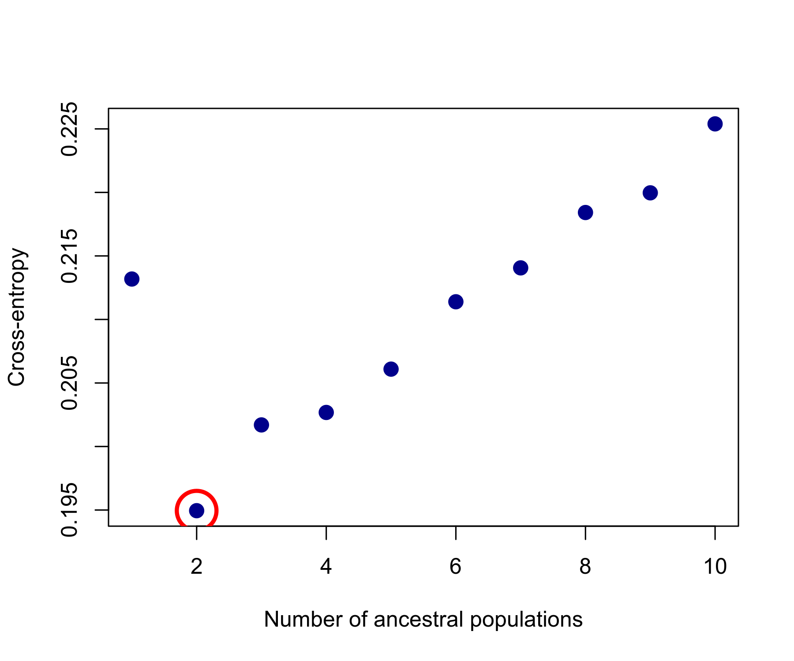

Here we have a clear minimum at K = 2, suggesting two genetic clusters within the dataset. Often, the plot shows a less clear pattern, and choosing the "knee" point is a generally good approach.
The next step is to display a barplot for the Ancestry matrix (also called the Q-matrix).

### Step 4: Plot ancestry proportions across samples
```
barchart(obj, K=2,run=best,border=NA,space=0,
         col=c("red","yellow"),
         xlab = "Individuals", ylab = "Ancestry proportions (K=2)", main = "Capelin lineages")
```
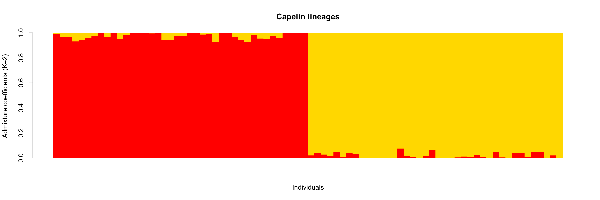

Well done! 
Next step, practice with the second dataset. What's your feeling about results ?

## 4. Structure with DAPC (Adegenet)
A Discriminant Analysis of Principal Components is a multivariate approach that merges a Principal Component Analysis (PCA) and a Discriminant Analysis (DA). A PCA aims to summarize the variation among individuals and it runs very fast, also on large datasets. However, it is not powerful at discriminating groups because it doesn't use any a priori information on grouping, and intra-group variation can overwhelm inter-group variation. A DA, on the other hand, tries to summarize the variation among groups, while minimizing the variatoin within groups. Thus, a DAPC takes the best of the two analyses to describe population structure. Also, compared to structure-like analysis it is not based on strict model assumptions and is more powerful at describing isolation-by-distance and hierarchical structure that the Bayesian approaches implemented in STRUCTRURE, fastSTRUCTURE, or ADMIXTURE.

On R studio, still with 02-day2 as working directory, we will use adegenet to do a DAPC.
Adegenet uses a file produced by stacks. To take your file, you usually need to change extension ```.structure```to ```.str``` but here we already did that for you.

Let's start analyzing the reduced dataset including 80 individuals from Canada and Greenland.

please be careful to copy the command line by line, as it will prompt questions.

```
### load adegenet package
library(adegenet)

### load dataset and convert it from structure to genind format
twolin<-import2genind("populations_2lin_random/populations.str") 
### This command will prompt questions about the structure of the file
# 80 ind and 8530 SNPs if you have used the file given

```

```
### Once the dataset is loaded, you can proceed with the DAPC
dapc_twolin<-dapc(twolin) 

### again the command prompt question
#choose 50 PCs and 1 distriminant function, as you did have a choice...
###To plot results
scatter(dapc_twolin)
```
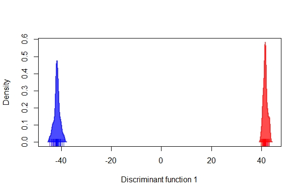

Because our dataset contains only two groups, NWA (Canada) and GRE (Greenland), we have only one discriminant function available. For this reason, we can plot our results across only one axis of variation. However, you can see that that's enough to sharply and unequivocally separate the Canadian and Greenlandic lineages.

You can repeat this analysis with the full dataset ```populations_all_random/populations.str```.
```
all<-import2genind("populations_all_random/populations.str") 
# 280 ind and 7943 SNPs

dapc_all<-dapc(all) 
### play with number of PC and DF

scatter(dapc_all)
```
What do you see now?

If any structure is present among the Canadian populations, it may be hidden by the strong differentiation between the Canadian and Greenlandic lineages.
So let's repeat the analysis including only the Canadian populations, and use this to explore how to select the right number of PCs. Run and visualize the DAPCs based on 100 and 200 PCs.
```
canada<-import2genind("populations_canada_random/populations.str") 
# 240 ind and 8018 SNPs
dapc_canada1<-dapc(canada, n.da=4, n.pca=100)
dapc_canada2<-dapc(canada, n.da=4, n.pca=200)
scatter(dapc_canada1)
```
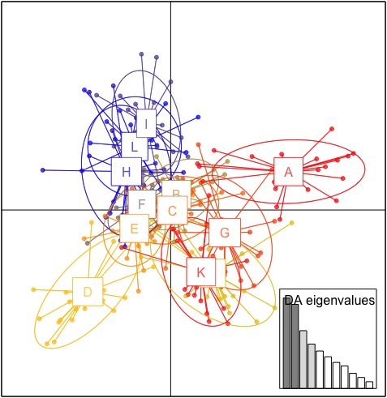
```
scatter(dapc_canada2)
```
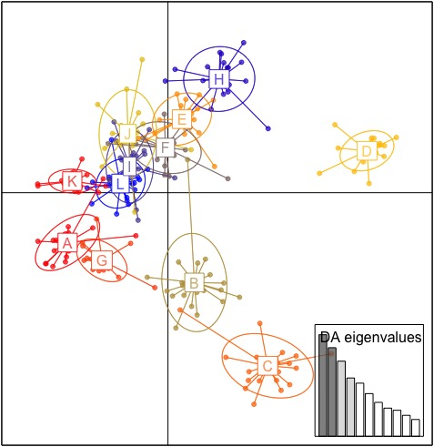


If too few PCs (with respect to the number of individuals) are retained, useful information will be excluded from the
analysis, and the resultant model will not be informative enough to accurately discriminate
between groups. By contrast, if too many PCs are retained, this will have a destabilising
effect on the coefficients extimated, leading to problems of overfit. In such cases, the
model is able to describe all of the data in such detail that it becomes flexible enough
to discriminate almost perfectly between any possible clusters.

However, we can assess the trade-off between power of discrimination and over-fitting by calculating the alpha-score, which is the difference between the proportion of successful reassignment of the analysis (observed discrimination) and values obtained using random groups (random
discrimination).
```
temp1 <- optim.a.score(dapc_canada1)
temp2 <- optim.a.score(dapc_canada2)
```
These analyses suggest I should use fewer PCs, around 50.
```
dapc_canada3<-dapc(canada, n.da=4, n.pca=50)
```
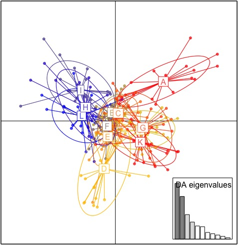


Another way to see the effect of the choice of the number of PCs is from stucture-like plots made with the function ```compoplot```, which plots the assignemnt proportions of each individual.
```
compoplot(dapc_canada1)
```
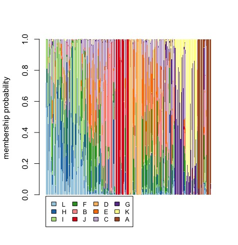
```
compoplot(dapc_canada2)
```
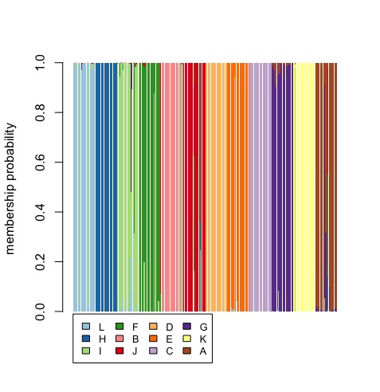
```
compoplot(dapc_canada3)
```
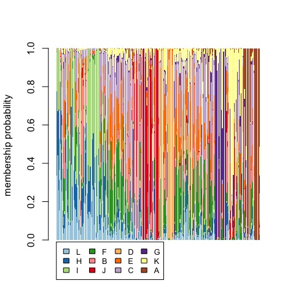


Although 200 PCs discriminate populations well, we know from low pairwise population F<sub>ST</sub> that differentiation is very low, which lead us to conclude that these high population assignments are the consequence of data over-fitting. On the other hand, the poor population assignemnt you obtain from 50 PCs is indicative of the weak population structure among the Canadian populations.

You can change pretty much everything in your plot and the authors of adegenet have put together a great tutorial <https://adegenet.r-forge.r-project.org/files/tutorial-dapc.pdf>


