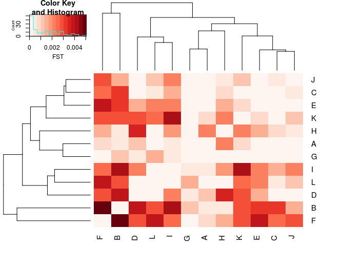

### 1.1 Pairwise differentiation between populations

**[On the Amazon server]**
We will calculate here FST between all pairs of populations. FST accross the genome are expected to be largely driven by neutral markers while peaks of FSt may be related to selection for local adaptation... So we will first try to get a sense of global pattern and then look for outliers

To get pairwise FSt, we will use the R package STAMPP.
to save time today, we will use a toolbox developped by Yann Dorant. You may be interested in looking at the scripts to understand how this is done.
This toolbox embed various useful script in order to fastly convert vcf format to common pop genomics formats (genepop, StAMPP, baypass, bayenv...). If you are interested to learn more about this toolbox, you will find the full description at https://gitlab.com/YDorant/Toolbox

To download the toolbox in your current working folder on the server (03_day3), use the following command line:
```
git clone https://gitlab.com/YDorant/Toolbox
```

To run, the Toolbox needs an unzipped vcf file (I'have to add the gzip option in the Toolbox for the next update !).

So, unzip the vcf with the following command :
```gunzip 02-data/populations.snps.vcf.gz```

Then move to the Toolbox directory with ``cd Toolbox/``

Ok, now we are ready to convert our VCF files to the StAMPP file format. The toolbox have an easy way to do that with a bash script. This bash script require four args:
* -v VCF file
* -p population map
* -f output file format
* -o output prefix name

```
bash Toolbox/00-VCF_Reshaper.sh -v ../02_data/populations.snps.vcf -p ../02_data/popmap_canada.txt -f StAMPP -o canada
```

Then check your current folder ``ls``, you should be able to see your ``.StAMPP`` input file (*quick overview of the file with less -S command).

Then, we can run the Rscript `StAMPP-fst.R` to perform pairwise FST for each dataset. This script require three args.
* Input StAMPP file
* Output prefix
* Number of CPU allowed (default CPU=1)

NOTE: dont' worry about the error message. It only say that it cannot delete temporary files. It's not important.

** !!! Before using it, you have to install the package in you own server session.**

Please open an online R session : just tap R in the shell.

Once R in open, install the required packages using the following lines. Please use them one by one and answer "yes" if it asks you to install a personnal library. it may take a few minutes and write lots of line. please be patien and don't close the terminal.

```
install.packages("BiocManager")
install.packages("varhandle")
#install StAMPP via BioConductor pathway
BiocManager::install("StAMPP")

#once all is installed--quit R
q()
```

Here we are ready to run the StAMPP and perform FST calculations.
```
Rscript StAMPP-fst.R canada.StAMPP canada 1
```
Allowing 1 CPU, each FST calculation should take around 5-6 minutes

Once FST calculations are done, you will see that four FST output files have been generated per dataset.
* prefix_fst_bootstrapes.txt
* prefix_fst_matrix.txt
* prefix_fst_pvalue.txt
* prefix_fst_reshape.txt

Here, move this files to the FST folder with ```mv canada_fst*.txt ../FST```, then move in this folder with ```cd ../FST``

You can explore each of one with the cmd line ``less -S file.txt``. However, today, we only use the FST matrix.

So, now you can export the whole 02_day2 folder to your local computer. 
Inside you will have the pairwise FST matrix (file suffix ``_fst_matrix.txt``) in the subfolder FST and the info files about populations in the subfodler ``documents/``
* documents/info_samples.csv
* documents/popmap_canada.txt


**[On your local computer]**
We are now in Rstudio on your computer. Please set you working directory as "03_day3"

We keep it simple and do a simple numeric matrix but you can imagine more fancy ways, with heatmaps or so.

First, load the required libraries
```
# Libraries
  library(dplyr)
  library(magrittr)
  library(tibble)
  library(gplots)
  library(RColorBrewer)
  library(corrplot)
# --------------
```
Second, I give you a useful fonction to deal with the FST matrix. In fact, this is a triangular matrix and we need to fill the upper diag to use the heatmap function.
So, to do this, I give you the following function. Add it in your Rscript.
```
makeSymm <- function(m, position) {
    # Add symetrical triangle matrix (upper or lower)
  if (position == 'upper'){
    m[upper.tri(m)] <- t(m)[upper.tri(m)]
    return(m)
  }
  if (position == 'lower'){
    m[lower.tri(m)] <- t(m)[lower.tri(m)]
    return(m)
  }
}
```
Now we can load the data, arrange it and then plot.

```
#-------------- fst matrix for all SNPs --------------------
fst.mat <- read.table("03_fst/canada_fst_matrix.txt")
#use the function to fill the full matrix
fst.all.mat<- fst.mat %>%
              as.matrix(.) %>%
              makeSymm(., 'upper')
fst.all.mat[is.na(fst.all.mat)] <-  0 #replace NAs by 0 (NAs unaccepted for the heatmap function)
fst.all.mat[1:10,1:10] #check the fst_matrix
              
#visualise values
corrplot(fst.all.mat, is.corr = FALSE, method="number", addgrid.col = FALSE, diag=F, type="lower", number.digits = 3, number.cex=0.7)

#Visualize pairwise FST through a heatmap
gplots::heatmap.2(fst.all.mat, trace = 'none',
                  col= colorRampPalette(brewer.pal(9, "Reds"))(15),
                  key.xlab='FST')
```
Note that values goes up to FST = 0.02 ! but most of them are very low


What do you notice? Is it heterogeneous? Do some population look more differentiated than other?
Why do you think A and J are so different? 

### 1.2 Isolation by distance
To explore whether this is linked to distance between population, we will do a IBD test (Isolation by distance)
```
library(SoDA)
library(reshape2)
library(dplyr)
library(magrittr)
library(tibble)
library(ggplot2)

#import information about populations
info_pop <- read.table("02_data/info_pop_geo_eco.txt", header=T)
head(info_pop)
#calculate geogrpahic (euclidian) distances between all pairs of populations
distance <- dist(SoDA::geoXY(info_pop$latitude, info_pop$longitude)) %>%
  as.matrix(.)
dimnames(distance) <- list(info_pop$pop,info_pop$pop)
distance

#prepare datasets
#linearize the distance matrix
dist.melt <- reshape2::melt(distance) %>%
  set_colnames(., c('pop1', 'pop2','distance'))
head(dist.melt)

#linearize the fst matrix
fst.melt <- reshape2::melt(fst.all.mat) %>%
  set_colnames(., c('pop1', 'pop2','FST'))

#join the distance and fst
IBD.df <- left_join(dist.melt, fst.melt, by=c('pop1','pop2')) %>%
  filter(., distance > 0)
head(IBD.df)

#test association with FST
cor.test(log(IBD.df$distance), IBD.df$FST/(1-IBD.df$FST))

#plot IBD
ggplot(IBD.df) + aes(x=log(distance), y=FST/(1-FST)) +
  geom_point() +
  geom_smooth(method='lm', formula= y~x) +
  theme_bw()
```


So Isolation by distance is not significant and it does not seem that geography can explain the genetic distances very well with this full dataset.
If we come back to our heatmap, we can notice the cluster of populations C, F, I. How do you interpret it?

Let's look at the sex ratio in our data.
```
info_ind<-read.table("02_data/info_samples_canada.txt", header=T)
head(info_ind)
table (info_ind$pop,info_ind$sex)
```
```
    F  M
  A  0 20
  B 10 10
  C  0 20
  D 15  5
  E 10 10
  F  5 15
  G 10 10
  H 10 10
  I  0 20
  J 18  2
  K 10 10
  L 10 10
 ```
It seems that the field sampling has not been very good at balancing sex-ratio between populations... We should be worried about sex-linked markers driving the signal!It may be one of the reason why A and J are the most diferrentiated
(note: we intentionnaly subsetted the dataset to create this bias which was not in the original publication ;-) but it may happen easily for some species or low sample size)

Yesterday, we saw that a region of chromosome 4 and sex-linked markers on chr 5 were overwhelming the structure. Will that influence our pairwise estimates? Possibly
Let's re-run the steps above on the vcf in which we removed the chr5 and chr4 (skip that if you are late).

Let's look at the pairwise FST matrix and the IBD stats


What do you see now?
pay attention to the absolute value of FST, to the clustering and IBD (or the absence of)?
