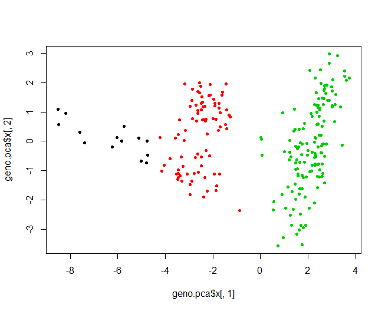
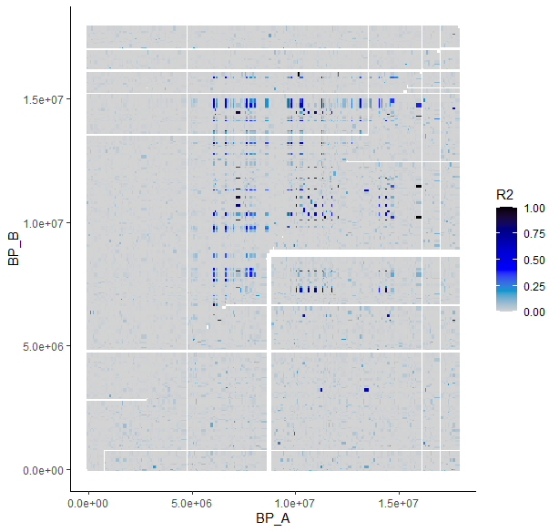
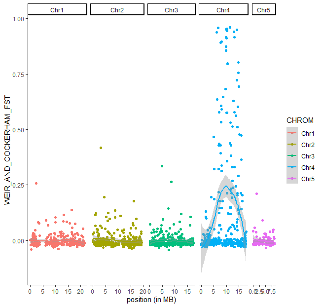
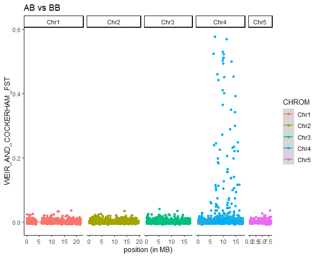
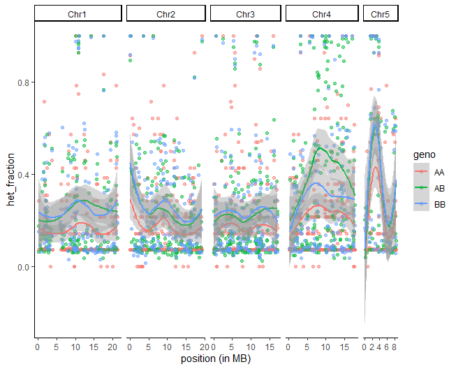
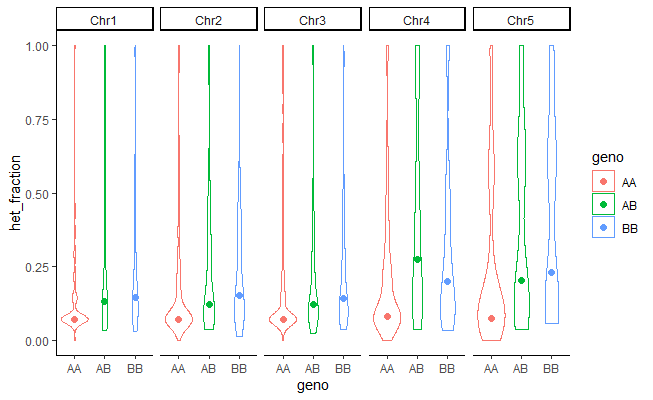

# Exploring differentiation heterogeneity across the genome and putative chromosomal rearrangements on Chr 4
IMPORTANT: Please copy all the folder 04_day4 from `~/Share` into you repository on the AWS server. Please copy it in your own computer and try to follow the same folder architecture when moving your files.

```
cd 
cp -r ~/Share/physalia_adaptation_course/04_day4 .
cd 04_day4/01_haploblocks
```
We will run all commands from this folder.

## Step 1. Local PCA along the genome to detect non-recombining haploblocks
As you saw on day 2, the PCA performed on the 240 samples from the 12 populations from Canada displays a very unexpected pattern. The loadings indicate that some portions of the genome are overwhelmingly driving population structure, making us suspect there may be sex-linked markers and/or chromosomal rearrangements.

To get a better sense of what's going on, we will be running a PCA again, but along the genome using windows of X SNPs. For this we will use  R package *lostruct*, available here https://github.com/petrelharp/local_pca and presented in this publication https://www.genetics.org/content/211/1/289.

####  Prepare files
We will skip the preparation of the file and the 1st steps of lostruct to read and prepare the windows because R does not communicate with bcftools on the AWS and we want to save you time to see all the analysis. So keep in mind that there are preparative steps if you want to re-do the analysis on your dataset. 
[Link to preliminary steps in_lostruct](https://github.com/clairemerot/physalia_adaptation_course/blob/master/04_day4/01_haploblocks/step0_filepreparation.md)

Briefly, this analysis is more powerful if we keep all SNPs, including those in LD so we will use the unfiltered VCF (before we even selected one random SNP per RAD locus) for the 12 canadian populations. We convert this file into BCF format. Then we use a function in lostruct to make windows of your chosen size. We suggest to use window of 100 SNPs since coverage of the genome is low (RAD data) and we don't have a lot of SNPs. Typically, with whole genome data you may first run by windows of 1000 or 5000 SNPs for a first look, and then refine the analysis with smaller windows. The analysis can be run chromosome by chromosome (as in the paper) or on the entire genome. Here, we are going for the entire genome.

Then, lostruct runs the PCAs on each window. Here we choose to retain the first 2 PC (Principal Components - k=npc=2) because they usually capture the most variance for each local PCA.

The output consists of a matrix in which each row gives the first k eigenvalues and k eigenvectors for each window. This gives you a matrix with 483 columns (3 columns of info, 240 columns with PC1 score for each individual, and 240 column with PC2 score for each individual). The matrix consists of as many rows as windows (1016 with windows of 100 SNPs). I added 3 columns of information about the window position. you can have a look at it with

```
less -S 00_localPCA/pca_matrix.txt
```
escape less by pressing "q"

####  Run lostruct (on the server)
We will run the final steps of the lostruct Approach. you can do it either on the terminal (start R ) or in Rstudio on your computer

Installing the libraries will write a lot of lines, don't worry it means it is going well. Answer "y" if it asks you if you want a personal library, and 1 if you are ask to pick a cran mirror. Please run the lines one by one.

```
#install libraries
install.packages("data.table")
devtools::install_github("petrelharp/local_pca/lostruct")

#load libraries
library(data.table)
library(lostruct)
```


```
#load matrix
pca_matrix<-read.table("00_localPCA/pca_matrix.txt", sep="\t", header=T, stringsAsFactors=FALSE)
head(pca_matrix)
#split columns with positions information and PC
window_pos<-pca_matrix[,1:3]
pcs<-as.matrix(pca_matrix[,4:dim(pca_matrix)[2]])
```

The lostruct approach is based on the computation of pairwise distances between windows and their visualization with a MDS (multidimensional scaling). Our goal is to identify groups of windows that display similar PCA patterns. This is done with the following functions (we uses 2 PC per window as above, and will look at the 1st 10 axes of the MDS)
```
pcdist <- pc_dist(pcs,npc=2)
mds_axe<-cmdscale(pcdist, k=10)
head(mds_axe)

#again the mds file is missing position information so:
mds_matrix<-cbind(window_pos, mds_axe)
write.table(mds_matrix, "00_localPCA/mds_matrix.txt", sep="\t", row.names=FALSE, quote=FALSE)
```
Since this will take some time, we can let it run and explore on your local computer with Rstudio some of the local PCAs. Let's download `pca_matrix.txt` locally and play in Rstudio to look at some of those local PCAs.

#### Visualising the local PCA outputs (on your computer in Rstudio)
Back on our local computer in R studio, we will look at all those local PCA.
Set your working directory as 04_day4/01_haploblocks, load required libraries (ggplot2) and the matrix of PCAs

```
setwd("MY_LOCAL_PATH/04_day4/01_haploblocks")
library(ggplot2)

#load pca matrix
pca_matrix<-read.table("00_localPCA/pca_matrix.txt", header=TRUE)
pca_matrix[1:10,1:10]
n_windows<-dim(pca_matrix)[1] # the number of windows we have
```

We may want to simply plot the PCAs for some windows. This is a little difficult due to the tricky matrix format.
Look at the format. We have 3 columns for position, total eigen values, eigvalue of PC1, of PC2 and then 240 values for PC1 scores of all our samples, and 240 values for PC2 scores of all samples
```
   chrom   start     end      total    lam_1     lam_2   PC_1_L_01    PC_1_L_02    PC_1_L_03    PC_1_L_04
1   Chr1    4598  102627 11.2676700 2.237855 1.2467539  0.04757381  0.003211281  0.048236420 -0.029799279
2   Chr1  102627  298945  5.4675252 1.664517 1.1009505  0.05177397 -0.066433281  0.056306263  0.057187867
3   Chr1  298949  557448 20.3195707 3.514855 2.5803417 -0.07997331 -0.014285140 -0.077618567  0.061921540
4   Chr1  557463  664701  7.9826780 1.707709 1.4688195  0.00317093 -0.027442327 -0.003586276 -0.025939893
```

So to get information for a window we can do something like:
```
Nind<-240
i=15 #for the 15th window

pc1_i<-t(pca_matrix[i, 7:(Nind+6)]) #scores along PC1
pc2_i<-t(pca_matrix[i, (Nind+7):(2*Nind+6)]) #scores along PC2
var1<-round(pca_matrix[i, 5]/pca_matrix[i, 4],2)*100 # % of variance explained by PC1
var2<-round(pca_matrix[i, 6]/pca_matrix[i, 4],2)*100 # % of variance explained by PC2
midpos_i<-(pca_matrix[i, 2]+pca_matrix[i, 3])/2 #average position of the window
window_i<-paste(pca_matrix[i, 1], midpos_i , sep="_") #paste the name of CHR and the midposition

plot(pc1_i, pc2_i, pch=20, xlab=paste("PC1", var1 , "%"), ylab=paste("PC2", var2, "%"), main=window_i)
```

Not super clean but it works. Building on that you can do anything to reformat your matrix of PC, eigen values, etc...

Now we want to look at which windows explain the pattern observed in the global pca (the 3 haplogroups). We can look at correlation between global PCs and PC1 of each local PCA. I propose to take the PCA performed on the 12 NWA populations, and look at the correlation between PC1 of the global PCA and PC1 of each local PCA (then you can do the same with PC2 of the global PCA and PC1 of each local PCA...). To help, I put the geno-transformed matrix inside your folder so that you don't need to go back to vcftools but the .012 file has been done exactly as shown on day2.

I suggest below a very basic loop to store the correlation by windows. You can probably do something more fancy :-)
Please note here that we could also have used the genotype correlation, for instance call 0/1 or 0/1/2 the cluster observed on the global pca and then look for each snps at the correlation between genotypes and genotype for the cluster identified.

```
geno <- read.table("00_localPCA/canada.012")[,-1] #load geno
geno[1:6,1:6] #check the geno matrix
global.pca<-prcomp(geno) #run the pca
plot(global.pca$x[,1],global.pca$x[,2]) # plot the pca
PC_of_interest<-global.pca$x[,1] #if you want to look at correlation with PC1

#initialise the vector
corr_vector<- vector(length=n_windows)
#loop over windows to store correlation factor
for (i in 1 : n_windows)
{
  pc1_i<-t(pca_matrix[i, 7:(Nind+6)]) #scores along PC1
  corr_vector[i]<-abs(cor(PC_of_interest, pc1_i)[1,1])
}

```
Now let's merge correlation and position to do a Manhattan plot of correlations along the genome. We need to take a midposition for each window.
I suggest that we use ggplot to visualize and facet_grid is a useful way to make quick Manhattan plots with chromosome side by side
```
pca_correlation<-cbind(pca_matrix[,1:3], corr_vector)
pca_correlation$midpos<-(pca_correlation$start+pca_correlation$end)/2
head(pca_correlation)

ggplot(pca_correlation, aes(x=midpos, y=corr_vector, colour=chrom))+
  geom_point()+
  theme_classic()+
  facet_grid(cols = vars(chrom), scales = "free_x", space="free_x")
```

What do you see?  Which windows correlate with PC1? What do you think?


Now you can have a look at correlation between local PC1s and the global PC2...

####  Using the MDS
Here that was easy, because we knew there was something weird on PC1 and PC2. But please keep in mind that, even if on the global PCA no region is driving a specific clustering, there may still be, on some chromosome, or some regions, similar clustering of individuals due to population structure, chromosomal rearragements, sex, non-recombining haploblocks, etc. Exploring the MDS is a way to detect such heterogeneity in the genome.

Let's load the MDS and plot the first axes
```
mds_matrix<-read.table("00_localPCA/mds_matrix.txt", header=TRUE)
head(mds_matrix)
mds_matrix$midpos<-(mds_matrix$start+mds_matrix$end)/2

#for ggplot you need to rename the columns
colnames(mds_matrix)<-c("chrom","start","end","mds1","mds2","mds3","mds4","mds5","mds6","mds7","mds8","mds9","mds10")

ggplot(mds_matrix, aes(x=mds1, y=mds2, colour=chrom))+
  geom_point()+
  theme_classic()
ggplot(mds_matrix, aes(x=mds3, y=mds4, colour=chrom))+
  geom_point()+
  theme_classic()
```


As you see, MDS 1 and 2 are largely driven by Chr4 and Chr5. Let's look at MDS scores along the genome to pinpoint those regions.
Building on what we did before, you can probably make a Manhattan plot with a midposition as x, and mds1 or mds2 as y.

```
mds_matrix$midpos<-(mds_matrix$start+mds_matrix$end)/2

ggplot(mds_matrix, aes(x=midpos, y=mds1, colour=chrom))+
  geom_point()+
  theme_classic()+
  facet_grid(cols = vars(chrom), scales = "free_x", space="free_x")
  
ggplot(mds_matrix, aes(x=midpos, y=mds2, colour=chrom))+
  geom_point()+
  theme_classic()+
  facet_grid(cols = vars(chrom), scales = "free_x", space="free_x")
```

This is the output for MDS2


To follow-up, You can try to find approximately the breakpoints of those areas that appear outliers.
We can locate them approximately from 4.8MB to 16.6MB on chromosome 4 and the full chromosome 5

#### A note about running R into a terminal or on a server
Instead of running R frontally, as we did at the beginning for lostruct, we could have written a whole script and run it with
```
Rscript my_fancy_script.R "option1" "option2"
```
The first lines my_fancy_script.R would be:
```
argv <- commandArgs(T)
option1 <- argv[1]
option2 <- argv[2]
```
## Step 2 Explore the putative haploblock

### Genotype the individuals for the haploblocks
Thanks to our local PCA exploration on day 2, we know that there are non-recombining haploblocks, which on chromosome 4 may be an inversion.
We located the breakpoints approximately from 4.8MB to 16.6MB. We can make a PCA based on variants in that region only and use k-means approaches to classify the individuals into 3 groups. 

To save time I did this for you and put the AA.list, AB.list and BB. list into the 02_data folder. 

If you are interested in the code, you can have a look in this file
[extract_genotypes_from_pca](Step1_tuto.md)



### Study linkage disequilibrium

#### On the server: calculate LD with Plink
To calculate LD we will use plink, but not in pruning mode. We want all pairwise LD on each chromosome.
We will remove SNPs at low frequency as they are not very informative and increase the size of the matrix (>5% of frequency - we could have filter up to 5% or 10% with whole genome data). 
We will focus on chromosome 4 but feel free to try other chromosomes.

Plink requires three inputs (.bed, .bim, .fam). The argument --r2 calculate the LD as R2 (you could also have chosen D), inter-chr makes a long matrix (square would make a square one).
We need to add --allow-extra-chromosome since we are not working with human data and --ld-window-r2 0 to require all output to be printed. To reduce the file you can choose here a minimum threshold for R2

```
#unzip vcf
gunzip 02_data/canada.vcf.gz

#extract a reduced vcf 
vcftools --vcf 02_data/canada.vcf --chr Chr4 --maf 0.05 --recode --out 03_ld/maf0.05_chr4

#format for plink
plink --vcf 03_ld/maf0.05_chr4.recode.vcf --make-bed --out 03_ld/maf0.05_chr4

#calculate ld
plink --bed 03_ld/maf0.05_chr4.bed \
--bim 03_ld/maf0.05_chr4.bim \
--fam 03_ld/maf0.05_chr4.fam \
--r2 inter-chr --allow-extra-chr --ld-window-r2 0 \
--out 03_ld/maf0.05_chr4

head 03_ld/maf0.05_chr4.ld
```

Let's calculate LD within a group of homokaryotes. We choose the group that has many individuals. For me that was AA.

We want to consider the same SNPs so we used the recoded VCF with MAF >5% and kept the AA individuals using the command keep in vcftools.

```
#extract a reduced vcf with the same snps but only AA individuals
vcftools --vcf 03_ld/maf0.05_chr4.recode.vcf --keep 02_data/AA.list --recode --out 03_ld/AA_maf0.05_chr4

#format for plink
plink --vcf 03_ld/AA_maf0.05_chr4.recode.vcf --make-bed --out 03_ld/AA_maf0.05_chr4

#calculate ld
plink --bed 03_ld/AA_maf0.05_chr4.bed \
--bim 03_ld/AA_maf0.05_chr4.bim \
--fam 03_ld/AA_maf0.05_chr4.fam \
--r2 inter-chr --allow-extra-chr --ld-window-r2 0 \
--out 03_ld/AA_maf0.05_chr4

head 03_ld/AA_maf0.05_chr4.ld
```


####On your computer : plotting LD

Please take the two files .ld on your local computer (in the 03_ld folder)
We will use R to visualise our results

```
library(ggplot2)
#load data
chr4.ld<-read.table("03_ld/maf0.05_chr4.ld", header=T)
head(chr4.ld)

#plot (very simple solution with ggplot. maybe you can find something nicer..?
ggplot(chr4.ld,aes(x=BP_A,y=BP_B, col=R2)) + theme_classic() + geom_point(size=1, shape=15) + 
  scale_colour_gradientn(colours=c("lightgrey","deepskyblue3","blue","blue3","navyblue","black"), limits=c(0,1),  name="R2")
 
#load data homozygotes
AA_chr4.ld<-read.table("03_ld/AA_maf0.05_chr4.ld", header=T)
head(AA_chr4.ld)

ggplot(AA_chr4.ld,aes(x=BP_A,y=BP_B, col=R2)) + theme_classic() + geom_point(size=1, shape=15) + 
  scale_colour_gradientn(colours=c("lightgrey","deepskyblue3","blue","blue3","navyblue","black"), limits=c(0,1),  name="R2")

#plotting both heatmap on the same graph...
ggplot(chr4.ld,aes(x=BP_A,y=BP_B, col=R2)) + theme_classic() + 
  geom_point( shape=15) + 
  geom_point(data=AA_chr4.ld, aes(x=BP_B,y=BP_A,col=R2), size=1, shape=15)+
  scale_colour_gradientn(colours=c("lightgrey","deepskyblue3","blue","blue3","navyblue","black"), limits=c(0,1),  name="R2")

```


What do you think? do you observe the linkage possibly due to an inversion (or a non-recombining block?)? Is it also observed in the BB group?

### Studying divergence with Fst (optional)
We may be interested in calculating several statistics for each haplogroup (diversity, divergence, etc). For instance we can calculate Fst between our groups, as you learnt to do on day 2 with vcftools, both as an overall Fst value and in sliding-windows along the genome.
Note that here this is not ideal since it is better to have balanced sample size (and our group AA is pretty small).

If you are interested in following this extra tutorial, you will find all details here:

[Fst_sliding_windows](Step4_fst.md)

These are the results:



As you can note within our region of interest on Chr4, some SNP have a super high Fst (up to 1), suggesting fixed alleles and extremely high divergence.
You may have noticed that some FSt values are negatives.. This is likely driven by very low frequency alleles and inbalanced sample sizes. We also observe NA in the calculation of FSt by site.

Try to plot also the AA_AB and AB_BB contrasts. 




### Studying heterozygosity with the % of heterozygotes in each group (optional)
We are also interested to figure out whether heterozygosity is indeed higher in our AB middle group. We will use the --hardy options for vcftools which tests hardy-weinberg equilibrium for each SNP and report the observed and expected fraction of heterozygotes at each position

You can following the tutorial to do so here:
[Hobs_sliding_windows](Step5_Hobs.md)
This tutorial also includes how to subset vcf with vcftools, filter for MAF, extract H-W statistics, etc and some re-formatting.

These are the results:



As you observed on the Manhattan plots, there is a lot of heterogeneity between SNPs. Perhaps it might be worth looking at results by sliding-windows?
Our case is not ideal because SNPs are sparse (RAD-seq) but with whole-genome data you would have no choice but doing windows.


We can also visualize them with violin-plots


In all cases, we nevertheless note the expected higher observed heterozygosity in AB around the middle of Chr4. 
On Chr5, there is a region of high heterozygosity in all three groups, which may be driven by sex.

### About haploblocks
Not all haploblocks detected by MDS will be rearrangements. Low-recombination regions, introgression, linked selection or sex-determining loci can leave the same signature. If you are curious and if you have time, you may want to try exploring Chr5 in the same way to see what's similar and what differs. Note that you won't need the first step to find clusters since we already have the sex information.
