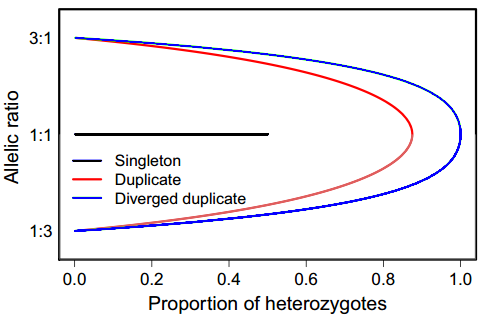
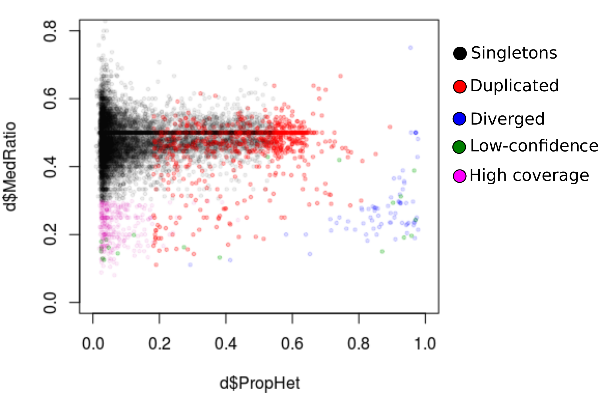
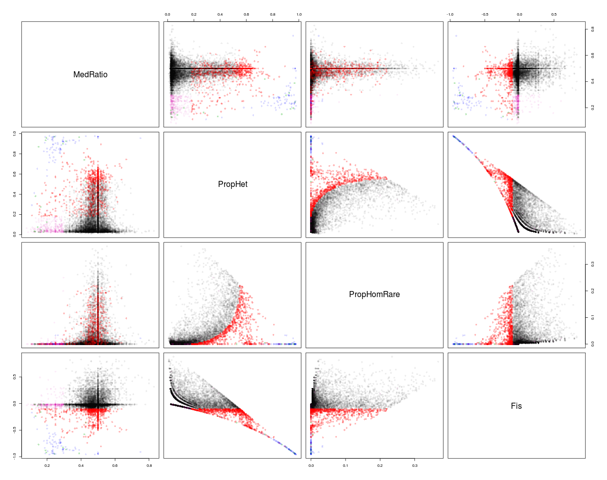
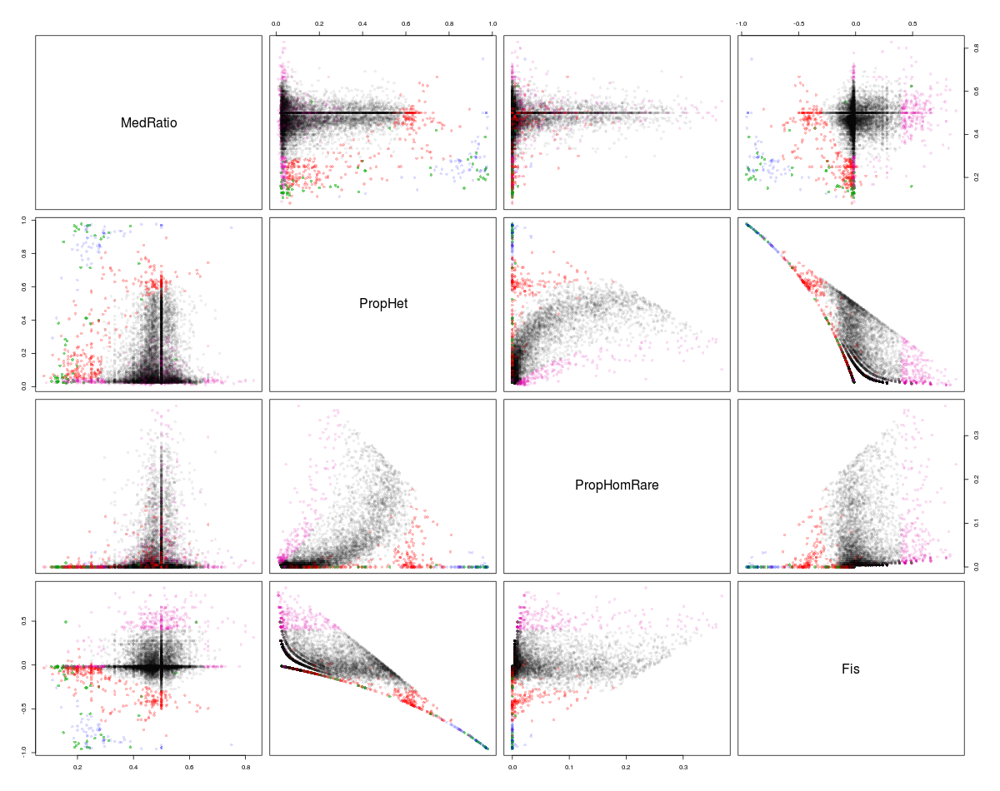
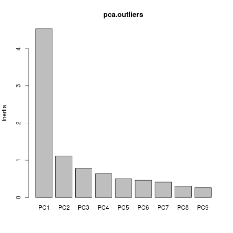
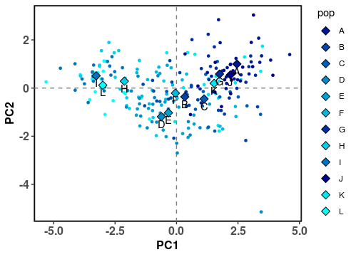

# Day4 : Copy Number Variants

## Overview
During this practical, you will search for putative copy number variants within a VCF file, using data from RAD-seq. Then, putative CNVs identified will be examined for environmental association with temperature. For this practical, we will use a lax filtered vcf file based on the 12 Canadian sampling sites.

#### [On the Amazon server]
### Step 1: Set working directory and copy basic files
If you have not done this yet, please copy the folder 04_day4/ from the share directory to your own repository and open it (cp is used for files and cp -r for folders). The "." indicates that it will copy where you are (I guess the root of your home directory).
Then, move to the folder for this tutorial --> ``cd 04_day4/02-CNVs/``

In the folder ``00-scripts/``, you will find all the scripts that we will use to extract CNVs info. Note that all these scripts came from the [stacks_workflow](https://github.com/enormandeau/stacks_workflow) developed by Eric Normandeau.

### Step 2: VCF filtering
To make is easier, I shared you a raw vcf file outputed from stacks.
This file is available in the folder : ``../../Share/ressources/capelin_NWA.vcf``. So, we will call this input file as such for the filtering process.

You can access to the number of SNPs available in this VCF by the cmd line : ``grep -v "#" ../../Share/ressources/capelin_NWA.vcf | wc -l``

Before analysis of CNV pattern, we will filter the raw vcf file in order to remove poor represented SNPs, which can introduce some bias in our analysis.
To do so, we will use the custom python script ``00-scripts/01_filter_vcf_fast.py`` and set the following options:
* minimum allele coverage to keep genotype = **4**
* minimum percent of genotype data per population = **60**
* maximum number of populations that can fail percent_genotypes = **0**
* minimum number of samples with rare allele = **6**

Here is the command line to run this script.
```
python 00-scripts/01-filter_vcf_fast.py ../../Share/ressources/capelin_NWA.vcf 4 60 0 6 02-data/capelin_canada_filtered_4_60_0_6.vcf
```
Ok, this will generate a filtered vcf file in your own user repository with the folder ``02-data/``

### Step 3: Explore SNP duplication
To explore locus duplication and then identify putative CNVs, we based our analyses on the previous work by [McKinney, Waples, et al. (2017)](https://onlinelibrary.wiley.com/doi/abs/10.1111/1755-0998.12613). Using population genetic simulations and empirical data, McKinney, Waples, et al. (2017) demonstrated that a set of simple summary statistics (e.g. the proportion of heterozygous and read ratio deviation of alleles) could be used to confidently discriminate SNPs exhibiting a duplication pattern without the need for a reference genome. Originally developed to deal with specific issues on whole-genome duplications and mixed ploidy problems in salmonids, McKinney, Waples, et al. (2017) method has been used to filter SNPs and to avoid miscalled genotypes, but it can also inform on CNVs.
In our recent work ([Dorant et al., 2020](https://onlinelibrary.wiley.com/doi/abs/10.1111/mec.15565)), we complemented the initial work of McKinney (2017) to explore SNP “anomalies” using on a suit of four parameters to discriminate high confidence SNPs (hereafter singleton SNPs) from duplicated SNPs: (a) median of allele ratio in heterozygotes (MedRatio), (b) proportion of heterozygotes (PropHet), (c) proportion of rare homozygotes (PropHomRare) and (d) inbreeding coefficient (FIS).

**Theory:** figure modified from McKinney et al. (2017)



First of all, we will use the following python script ``00-scripts/02_extract_snp_duplication_info.py`` to extract some statistics from the filtered vcf file.
* MedRatio
* PropHet
* PropHomRare
* Fis

```
python 00-scripts/02_extract_snp_duplication_info.py 02-data/capelin_canada_filtered_4_60_0_6.vcf 03-analyses/capelin_canada_filtered_4_60_0_6_overmerged_loci.txt
```
Then, we will make some descriptive plots using R in order to explore the expective pattern of various SNP categories. To do that, we have a basic Rscript that we can run with default options for initial observations.
Nevertheless, we will do this step at your local computer, where it should be easier to display and examine the figures.

So, in your local working folder, please download the whole folder **04_day4/02-CNVs/** (with scp for linux, Cuperduck for MACos and Filezila for Windows):

#### [On your local computer]
Run the Rscript 03.0-snp_categorization.R.R with the cmd line below.
```
Rscript 00-scripts/03.0-snp_categorization.R 03-analyses/01-snp_duplication/capelin_canada_filtered_4_60_0_6_overmerged_loci.txt
```
```
  diverged duplicated    highcov    lowconf  singleton
        73        852         20        319       8213
```




Here, we can see that the default options are not quite fitting the expected patterns. Look at the numerous red points (duplicated SNPs), which are distributed within the singleton pattern (black cloud) for the plot MedRatio vs PropHet.
In fact, each dataset is different, and defining SNPs categories require some adjustments to better fit with the expected pattern. So, we need to modify some options within the Rscript 03-0_snp_categorization.R.
To work with our own settings, we will copy the initial Rscript and then open it with Rstudio for modifications.

```
cp 00-scripts/03-0_snp_categorization.R 00-scripts/03.1_snp_categorization_modif.R
```

**Let see which modifications we can add to better define our SNP categories. Open your copy of the script in Rstudio and change the following sections:
**[1]**- Correction MedRatio/PropHet
```
# MedRatio is high/low and at least one rare allele homozygote
d$Color[d$MedRatio < 0.30 & d$PropHet < 0.05] = lowconf
d$Color[d$MedRatio > 0.65 & d$PropHet < 0.05] = lowconf
```
**[2]**-Correction for MedRatio/Fis
```
# Fis is too negative = duplicated
d$Color[d$Fis < -0.30] = duplicated
d$Color[d$Fis + d$MedRatio < 0.2] = duplicated
d$Color[d$Fis + d$MedRatio * 3 < 0.8] = duplicated

# High Fis
d$Color[d$Fis > 0.4] = lowconf
```
**[3]** High coverage
```
# Loci with high coverage
d$Color[d$MedCovHom > 60 | d$MedCovHet > 60] = highcov
```
-------> save you modifications.

Ok, now before to re-run the Rscript with your modifications, renamed the initial figures in ``03-analyses/01-snp_duplication/capelin_47006_overmerged_loci.txt_XX.png``, with the suffix ``.backup.png``.
Once this is done, you can rerun the Rscript with the following command.
```
Rscript 00-scripts/03.0-snp_categorization.R 03-analyses/01-snp_duplication/capelin_canada_filtered_4_60_0_6_overmerged_loci.txt
```
```
SNPs
  diverged duplicated    highcov    lowconf  singleton
        64        310         60        465       8578
```

**Note that this Rscript also write a table which contains SNP categories info.**


### Step 4: Split the vcf file to sub-vcf for each SNP categories
Once each SNPs have been attributed to a given category, we have to split the whole vcf file into sub-vcf constituted by each set of SNPs categorized. To do this, we will use a custom python script on the server.
 Before going back to the Amazon server, we have to upload the info file which contains the SNP categories info on the server, in the folder 04_day4/02-CNVs/.
#### [On the Amazon server]
Here, on the server, we will use a python script that split the whole vcf into five distincts sub-vcf. One for each category.
```
python 00-scripts/04_split_vcf_in_categories.py 02-data/capelin_canada_filtered_4_60_0_6.vcf capelin_canada_filtered_4_60_0_6_overmerged_loci.txt.categorized
```
You can see the five created sub-vcf by the cmd line : ``ls 02-data/*.vcf``

### (Optional) Step 5: Extract read count information for CNVs data
To examine the CNVs data, we will use the read count information available for each SNP whithin a vcf file as a proxy to inform us about putative variability among samples/populations.

To do so, we will extract the read count information from the vcf file containing duplicated SNPs using the software **vcftools**. The output is a matrix of read count where samples are distributed in rows and SNPs are distributed in columns.
```
vcftools --vcf 02-data/capelin_canada_filtered_4_60_0_6.duplicated.vcf --geno-depth --out 02-data/capelin_canada_filtered_4_60_0_6.duplicated
```
For further analyses, we also need the RADtag id of each duplicated SNPs. To get this information, use the following command line :
```
grep -v "#" 02-data/capelin_canada_filtered_4_60_0_6.duplicated.vcf | cut -f -3 | perl -pe 's/:/\t/g' | cut -f -4 > CNVS_RADtag_ids.txt
```
This will give you a file composed by four columns such as :
* Chr No
* Chr position
* RadTag id
* SNP position within the RadTag

Now, all analyses in the Amazon server are done. For the downstream analyses, we will go to Rstudio in local. Before this, you just have to download the required files in you local folder.
Here is the list of required files:
* 02-data/capelin_canada_filtered_4_60_0_6.duplicated.gdepth
* CNVS_RADtag_ids.txt
* 01-info_files/info_samples.csv

### (Optional) Step 6: CNVs read count normalization
#### [On your local computer]
As libraries sequenced at a greater depth will result in higher overall read counts, CNV locus read counts have to be normalized to account for differences in sequencing coverage among all samples. Normalization is performed using the trimmed mean of M-values method originally described for RNA-seq count normalization and implemented in the r package edgeR (Robinson & Oshlack, 2010). The correction accounts for the fact that for an individual with a higher copy number at a given locus, that locus will contribute proportionally more to the sequencing library than it will for an individual with lower copy number at that locus.

For this step, let's go to Rstudio ---> open a new script.
In the initial step, load the R libraries that we will need.
```
library(dplyr)
library(magrittr)
library(tibble)
library(edgeR)
```
Then, load the required data files.
```
# |---------|
# | Step 1  | ================> load data files
# |---------|

#1.load population map
popmap <- read.table("01-info_files/info_samples.csv", h=T, sep=';') %>%
              select(., -file) #remove column file which unecessary here

#2. load the CNVs_radTag information
CNVs_radTag <- read.table("CNVs_RADtag_IDs.txt") %>%
      set_colnames(., c("CHROM", "POS", "RadTag", "TagPOS")) %>%
      mutate(., RadTag_all=paste(CHROM,POS,RadTag,sep='_'))

#3. load gdepth file of duplicated SNPs (output from vcftools --geno-depth)
gdepth_raw_data <- read.table("02-data/capelin_canada_filtered_4_60_0_6.gdepth", h=T) %>%
                        mutate(.,  RadTag_all =  CNVs_radTag$RadTag_all) %>%
                        select(., CHROM, POS, RadTag_all, everything())

#check the data
gdepth_raw_data[1:10,1:10]

#correct missing data -1 to 0
gdepth_raw_data[gdepth_raw_data == -1] = 0

#check if missing value have been change to 0
gdepth_raw_data[1:10,1:10]

```

```
# |---------|
# | Step 2  | ================> prepare gdepth data for normalization
# |---------|

gdepth_transformed <- dplyr::select(gdepth_raw_data, -CHROM, -POS) %>% #remove POS col
  dplyr::distinct(., RadTag_all, .keep_all=TRUE) %>% #keep only one loci info
  column_to_rownames(., var = 'RadTag_all')

# check data
dim(gdepth_transformed)
gdepth_transformed[1:10,1:10]
```

```
# |---------|
# | Step 3  | ================> perform normalization with EdgeR package
# |---------|
####################
#create list to store info
DGE_list <- DGEList(counts=as.matrix(gdepth_transformed))

#calcul the normalization factor
gdepth_norm_Fact <-calcNormFactors(DGE_list)

#Normalize read counts based on the normalization factor
gdepth_normalized <- cpm(gdepth_norm_Fact, normalized.lib.sizes = TRUE, log = F)

gdepth_normalized[1:10,1:10]

#change 0 values to NA
gdepth_normalized[gdepth_normalized == 0] <-NA

gdepth_normalized[1:10,1:10]
```
write final matrix of CNVs normalized read depth
```
write.table(gdepth_normalized, "02-data/capelin_canada_CNVs_gdepth_normalized.txt",
            col.names = T, row.names = T, quote = F, sep="\t")
```
The complete Rscript for CNV read count normalization is available in the folder ``00-scripts/00-corrections_scripts/``.


### (Optional) Step 7 : Test for CNVs-environment association
For this part, we will re-use the Redundancy Discriminante Analysis (RDA), already used during the day3. First of all, we will open a new Rscript file in Rstudio and load required packages.

```
library(dplyr)
library(magrittr)
library(tibble)
library(ggplot2)
library(vegan)
```

Then, we load the required data files : **poulation map** and the **CNV matrix of normalized read counts**.
```
# |---------|
# | Step 1  | ================> load data
# |---------|

#1.load population map
popmap <- read.table("01-info_files/info_samples.csv", h=T, sep=';') %>%
  dplyr::select(., -file) %>% #remove the column file -> unecessary
  dplyr::filter(., region == 'NWA') #keep only canadian sampling sites

#2.import CNVs matrix format
CNVs.mat <- read.table("02-data/capelin_CNVs_gdepth_normalized.txt")

CNVs.mat[1:4,1:4] #check the data
```
This will return this head table
```
Chr1_140 Chr1_461  Chr1_476 Chr1_506
L_01 2407.795 2568.314  963.1179 2086.756
L_02 2139.489 1711.591 1026.9547       NA
L_03 2544.003 1329.820 1387.6381 2139.275
L_04 2191.835 1043.731 1043.7311 1252.477
```

During the day 2, we found that a sex chromosome is represented within our data. Given the properties of sex chromosomes in species showing to dinstinct sex, it's presence in our data may introduce some bias.
In such, we will remove all loci related to the sex chromosome (Chr5) in our CNV matrix. That's easy with the following code line :
```
CNVs_no_sex_chr.mat <- CNVs.mat[,!grepl('Chr5_', colnames(CNVs.mat))]
```
Next, as for PCA, RDA does not accept missing data. So, we will use the same way that in day2 to impute the missing data (i.e. here using the average normalized read count overall samples for a given CNV locus).
```
#Impute missing values with the average of norm. read count overall
CNVs_no_sex_chr.imp.mat <- apply(CNVs_no_sex_chr.mat,2,function(x) replace(x, is.na(x), as.numeric(names(which.max(table(x))))))
CNVs_no_sex_chr.imp.mat[1:4,1:4]
```
```
Chr1_140 Chr1_461  Chr1_476  Chr1_506
L_01 2407.795 2568.314  963.1179 2086.7555
L_02 2139.489 1711.591 1026.9547  609.6095
L_03 2544.003 1329.820 1387.6381 2139.2755
L_04 2191.835 1043.731 1043.7311 1252.4774
```
You can see that the NAs have been imputed.
Well, we are ready to run the RDA!

**So your mission, should you choose to accept it, is to perform the RDA by your own**

**HELP: required R function to find RDA outliers**
```
outliers <- function(x,z){
  lims <- mean(x) + c(-1, 1) * z * sd(x)     # find loadings +/-z sd from mean loading
  x[x < lims[1] | x > lims[2]]               # locus names in these tails
}
```
**For the RDA outliers identification, we will choose a permissive threshold. Please set the detection limit to z=2.25 standard deviations (i.e. P < 0.012)**
NOte that x refer to your matrix of read count normalized.

Full code including the RDA step is available in the folder 00-scripts/CNVs_RDA_corrections.R

Ok, now just before going to the step 8, we have to write the list of our CNV loci informing if either they are outliers (i.e. associated with environment variable in our case) or not. We will use this list for the day5,
To do this, we will create a new dataframe to list all CNV loci and then add three others columns [CHR, POS, and TRUE/FALSE info]

```
#create a new list
list_of_CNVs_loci <- data.frame(CNV_locus=colnames(CNVs_no_sex_chr.imp.mat)) %>% #create an itinial column of CNVs ids. here we use the colnames from the CNVs matrix of read depth.
  mutate(., CHR=gsub('_.*', '',CNV_locus), #create a new column with only the CHR info (here gsub replace all strings from the _ by blank)
            POS=gsub('.*_','',CNV_locus), #create a new column with only the POSITION info (here gsub replace all strings before the _ by blank)
            outlier = ifelse(CNV_locus %in% list_of_CNV_candidates,TRUE,FALSE)) #here we create a new column to get oultiers info for each CNVs.
                                                                                #Here the question is, if you are in my outliers list ---> TRUE, else = FALSE.
#let's see our list
head(list_of_CNVs_loci)

#Write the list in your working folder
write.table(list_of CNVs_loci, "list_of_CNVs_loci.txt",
              col.names=TRUE, row.names=FALSE, sep="\t", quote=FALSE)
```

### (Optional) Step 8: Explore adaptive population structure led by outliers CNVs loci.

Ultimately, we will explore a putative pattern of adaptive population structure related with outliers CNV loci associated with the temperature through a PCA.
First, we have to filter the whole CNV matrix for only outliers loci detected by the RDA

```
CNVs_no_sex_chr.outliers.mat.imp <- CNVs_no_sex_chr.imp.mat[,
                  colnames(CNVs_no_sex_chr.imp.mat) %in% list_of_CNV_candidates]
```
Then, we can perform the PCA with the following command :
```
# perform PCA with candidate CNVs associated with temperature
pca.outliers <- prcomp(CNVs_no_sex_chr.outliers.mat.imp, scale=T)

#check the variances against the number of the principal component.
screeplot(pca.outliers)
```


Here, there is many ways to plot a PCA biplot from many packages. However, I'd like to use ggplot for this as it allow many configurations.
So, let's prepare the clean datasets for this figure:
```
# Prepare dataframe for PCA
pca.outliers.sub <- pca.outliers$x[,1:3] %>%  #select only the three first PCs
  as.data.frame(.) %>%  #switch matrix to dataframe object
  tibble::rownames_to_column(., var='id') %>% #mutate rownames to unique column of samples ids
  dplyr::mutate(., pop = popmap$pop, # add pop info
            temperature=popmap$temperature) %>% #add temperature info
  dplyr::arrange(., desc(temperature)) %>%  #sort temperatures in decreasing order
  dplyr::mutate(., color=rep(colorRampPalette(c('cyan',"darkblue"))(12),rep(20,12))) #add color scale
  ```
For the figure, it could be cool to also have the centroid position of each sampling site within the space.
We can get this data using this code :
```
#Get sites centroids positions for plotting
sites_centroids <- stats::aggregate(.~pop,data = pca.outliers.sub[,c(2,3,5)], mean) %>%
  dplyr::left_join(., select(pca.outliers.sub, pop, color), 'pop') %>% #add color info
  dplyr::distinct(.) #get only sites info

#check centroids dataframe
sites_centroids
```
```
pop         PC1        PC2   color
1    A  2.45694558  0.9980085 #001795
2    B  0.33474985 -0.3637964 #0045AA
3    C  1.12128138 -0.4504535 #005CB5
4    D -0.61891095 -1.1887476 #008BCA
5    E -0.32843262 -1.0263472 #00A2D4
6    F -0.04556047 -0.2109987 #00B9DF
7    G  1.74946621  0.5817469 #002EA0
8    H -2.12323449  0.2867376 #00D0E9
9    I -3.27011448  0.5098191 #0073BF
10   J  2.19271263  0.5498668 #00008B
11   K  1.53124116  0.1958616 #00E7F4
12   L -3.00014381  0.1183030 #00FFFF
```
Well, almost done ! Let's plot the final figure with ggplot2.
```
#plot the results
ggplot() +
  geom_hline(yintercept = 0, lty=2, col='grey50') + #add vertical dotted line at x=0
  geom_vline(xintercept = 0, lty=2,col='grey50') + #add horiz dotted line at y=0
  geom_point(data=pca.outliers.sub, aes(x=PC1,y=PC2, col=pop),cex=1)  + #add samples points
  scale_color_manual(values=as.character(as.factor(sites_centroids$color))) + #set colors
  geom_point(data=sites_centroids,aes(x=PC1,y=PC2,fill=pop),cex=3, pch=23) + # add sites centroids
  scale_fill_manual(values=sites_centroids$color) + #set colors
  geom_text(data=sites_centroids ,aes(x=PC1,y=PC2), label=sites_centroids$pop, #add site names
            nudge_x = 0.0, nudge_y = -0.20) +
  theme_bw()+ #set black&white ggplot theme
  theme(panel.background = element_rect(fill = 'white', color='black', size = 1.2), #personal theme modifications
        panel.grid = element_blank(),
        axis.title = element_text(size=12, face='bold'),
        axis.text = element_text(size=12, face='bold'))

#save it!
ggsave("PCA_biplot_oultiers_CNVs.png", width = 8,height = 6)
```



**Well, that was not so hard ? no ?**

**So to recap the main steps of this tutorial about CNVs exploration for environmental association.**
 * **Use a lax filtered vcf file (the higher the number SNPs and samples, the better CNV detection is)**
 * **Each dataset is unique and the characterization of singletons/duplicated require settings adjustement for each datasets**
 * **Use the read count info embeded in the vcf format (vcftools --geno-depth)**
 * **Normalize the read count data in R with edgeR**
 * **Remove sex related loci (it depends what is your question)**
 * **Fill missing data**
 * **Use RDA for CNV-Environment association (or other ways such as GLMMs)**
 * **Explore the results as you wish (e.g. PCA, BrayCurtis trees...)**


Some examples to better understand what kind of pattern we can observe depending on the dataset or species. (It is a gif, give it some time to swith to the next example)

